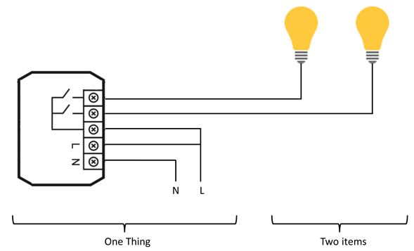



# Concepts

Eclipse SmartHome strictly differentiates between the physical view and the functional view on the system.
While the physical view is required for setup, configuration, troubleshooting, etc., the functional side covers the information that matter to applications, such as user interfaces and automation logic.

## Things, Channels, Items and Links

**Things** are the entities that can be physically added to a system and which can potentially provide many functionalities at once. It is important to note that things do not have to be devices, but they can also represent a web service or any other manageable source of information and functionality.
Things provide their functionality through a set of **Channels**. Channels are "passive" and can be regarded as a declaration of a Thing, what it can offer. It is up to the individual setup, which of the Channels are actively used through Items (see below).

**Items** represent (fine-grained) functionality that is used by applications - as user interfaces or automation logic. Items have a state and they can receive commands.

The glue between Things and Items are **Links**. Links are associations between exactly one Thing Channel and one Item.
If a Channel is linked to an Item, it is "enabled", which means that the functionality that the Item represents is handled through the given Channel.
Channels can be linked to multiple Items and Items can be linked to multiple Channels.

To illustrate these concepts, take a two-channel actuator that controls two lights:

The actuator is the _Thing_. This might be installed in the electrical cabinet, it has a physical address and needs to be setup and configured in order to be used.
The user is instead interested in the two lights, which are located at different locations in his home. These lights are the desired functionality, thus the _Items_ and they are linked to the _Channels_ of the actuator.
A _Link_ can be regarded like a physical wire in this example.

