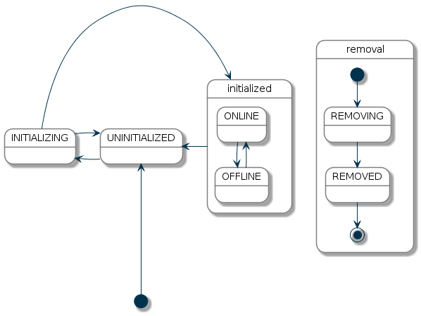

# Things

Things are the entities that can physically be added to a system and which can potentially provide many functionalities in one.
It is important to note that things do not have to be devices, but they can also represent a web service or any other manageable source of information and functionality.
From a user perspective, they are relevant for the setup and configuration process, but not for the operation.

Things can have configuration properties, which can be optional or mandatory.
Such properties can be basic information like an IP address, an access token for a web service or a device specific configuration that alters its behavior.

### Channels

Things provide "channels", which represent the different functions the thing provides.
Where the thing is the physical entity or source of information, the channel is a concrete function from this thing.
A physical light bulb might have a dimmer channel and a color channel, both providing functionality of the one light bulb thing to the system.
For sources of information the thing might be the local weather with information from a web service with different channels like temperature, pressure and humidity.

Channels are linked to items, where such links are the glue between the virtual and the physical layer.
Once such a link is established, a thing reacts on events sent for an item that is linked to one of its channels.
Likewise, it actively sends out events for items linked to its channels.

### Bridges

A special type of thing is a "bridge".
Bridges are things that need to be added to the system in order to gain access to other things.
A typical example of a bridge is an IP gateway for some non-IP based home automation system or a web service configuration with authentication information which every thing from this web service might need.

### Discovery

As many things can be automatically discovered, there are special mechanisms available that deal with the handling of [automatically discovered things](discovery.html).


## Thing Status

Each thing has a status object, which helps to identify possible problems with the device or service.
The following table provides an overview of the different statuses:

| Status        | Description |
|---------------|-------------|
| UNINITIALIZED | This is the initial status of a thing, when it is added or the framework is being started. This status is also assigned, if the initializing process failed or the binding is not available. Commands, which are sent to channels will not be processed. |
| INITIALIZING  | This state is assigned while the binding initializes the thing. It depends on the binding how long the initializing process takes. Commands, which are sent to channels will not be processed. |
| UNKNOWN       | The handler is fully initialized but due to the nature of the represented device/service it cannot really tell yet whether the thing is ONLINE or OFFLINE. Therefore the thing potentially might be working correctly already and may or may not process commands. But the framework is allowed to send commands, because some radio-based devices may go ONLINE if a command is sent to them. The handler should take care to switch the thing to ONLINE or OFFLINE as soon as possible. |
| ONLINE        | The device/service represented by a thing is assumed to be working correctly and can process commands. |
| OFFLINE       | The device/service represented by a thing is assumed to be not working correctly and may not process commands. But the framework is allowed to send commands, because some radio-based devices may go back to ONLINE, if a command is sent to them. |
| REMOVING      | The device/service represented by a thing should be removed, but the binding did not confirm the deletion yet. Some bindings need to communicate with the device to unpair it from the system. Thing is probably not working and commands can not be processed. |
| REMOVED       | This status indicates that the device/service represented by a thing was removed from the external system after the REMOVING was initiated by the framework. Usually this status is an intermediate status because the thing gets removed from the database after this status was assigned. |

The statuses UNINITIALIZED, INITIALIZING and REMOVING are set by the framework, where as the statuses UNKNOWN, ONLINE and OFFLINE are assigned from a binding.

Additionally, the REMOVED state is set by the binding to indicate that the removal process has been completed, i.e. the thing must have been in REMOVING state before.

### Status Transitions

The following diagram shows the allowed status transitions:



The initial state of a thing is UNINITIALIZED.
From UNINITIALIZED the thing goes into INITIALIZING.
If the initialization fails, the thing goes back to UNINITIALIZED.
If the initialization succeeds, the binding sets the status of the thing to UNKNOWN, ONLINE or OFFLINE, which all mean that the thing handler is fully initialized.
From one of this states the thing can go back into UNINITIALIZED, REMOVING or REMOVED.
The statuses REMOVING and REMOVED can also be reached from any of the other states.

## Status Details

A status is detailed further with a status detail object.
The following table lists the different status details for each status:

<table>
<tr valign="top"><td rowspan="6">UNINITIALIZED</td><td>NONE</td><td>No further status details available.</td></tr>
<tr valign="top">                                  <td>HANDLER_MISSING_ERROR</td><td>The handler cannot be initialized, because the responsible binding is not available or started.</td></tr>
<tr valign="top">                                  <td>HANDLER_REGISTERING_ERROR</td><td>The handler failed in the service registration phase.</td></tr>
<tr valign="top">                                  <td>HANDLER_CONFIGURATION_PENDING</td><td>The handler is registered but can not be initialized caused by missing configuration parameters.</td></tr>
<tr valign="top">                                  <td>HANDLER_INITIALIZING_ERROR</td><td>The handler failed in the initialization phase.</td></tr>
<tr valign="top">                                  <td>BRIDGE_UNINITIALIZED</td><td>The bridge associated with this thing is not initialized.</td></tr>
<tr valign="top"><td>INITIALIZING</td>             <td>NONE</td><td>No further status details available.</td></tr>
<tr valign="top"><td>UNKNOWN</td>                  <td>NONE</td><td>No further status details available.</td></tr>
<tr valign="top"><td rowspan="2">ONLINE</td>       <td>NONE</td><td>No further status details available.</td></tr>
<tr valign="top">                                  <td>CONFIGURATION_PENDING</td><td>The thing is waiting to transfer configuration information to a device. Some bindings need to communicate with the device to make sure the configuration is accepted.</td></tr>
<tr valign="top"><td rowspan="6">OFFLINE</td>      <td>NONE</td><td>No further status details available.</td></tr>
<tr valign="top">                                  <td>COMMUNICATION_ERROR</td><td>Error in communication with the device. This may also be only a temporary error.</td></tr>
<tr valign="top">                                  <td>CONFIGURATION_ERROR</td><td>An issue with the configuration of a thing prevents the communication with the represented device or service. This issue might be solved by reconfiguring the thing.</td></tr>
<tr valign="top">                                  <td>BRIDGE_OFFLINE</td><td>Assuming the thing to be offline because the corresponding bridge is offline.</td></tr>
<tr valign="top">                                  <td>FIRMWARE_UPDATING</td><td>The thing is currently operating a firmware update.</td></tr>
<tr valign="top">                                  <td>DUTY_CYCLE</td><td>The thing is currently in DUTY_CYCLE state, which means it is blocked for further usage.</td></tr>
<tr valign="top"><td>REMOVING</td>                 <td>NONE</td><td>No further status details available.</td></tr>
<tr valign="top"><td>REMOVED</td>                  <td>NONE</td><td>No further status details available.</td></tr>
</table>

### Status Description 

To provide additional information about the current status a description is used.
The status description is to be specified by the binding.
This description can be used for debugging purposes and should not be presented to the user, as it might contain unreadable technical information (e.g. an HTTP status code, or any other protocol specific information, which helps to identify the current problem).

### Thing Status API

The Thing interface defines a method `getStatusInfo()` to retrieve the current status of the thing.
The following code shows how to print the status of each thing into the console:

```java
Collection<Thing> things = thingRegistry.getAll();
for (Thing thing : things) {
    ThingStatusInfo statusInfo = thing.getStatusInfo();
    switch (statusInfo.getStatus()) {
        case ONLINE:
            System.out.println("Thing is online");
            break;
        case OFFLINE:
            System.out.println("Thing is offline");
            break;
        default:
            System.out.println("Thing is in state " + statusInfo.getStatus());
            break;
    }
    System.out.println("Thing status detail: " + statusInfo.getStatusDetail());
    System.out.println("Thing status description: " + statusInfo.getDescription());
}
```
