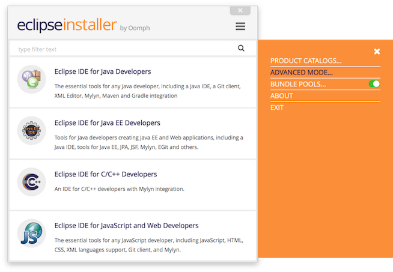
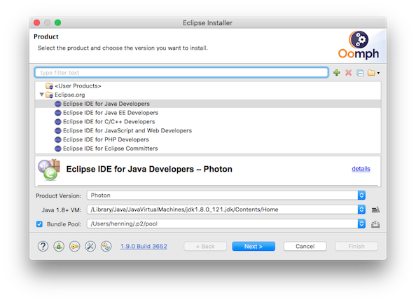
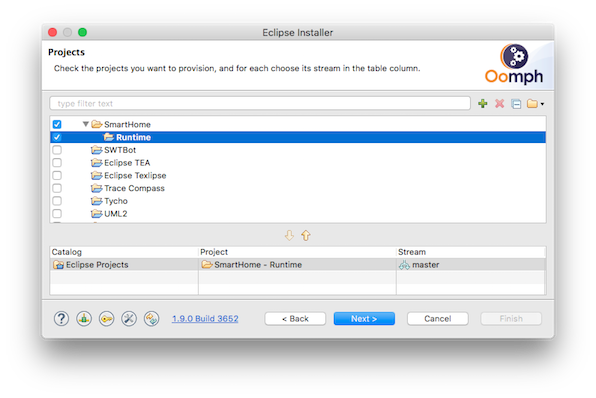
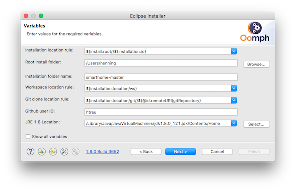
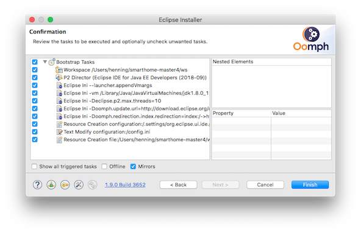
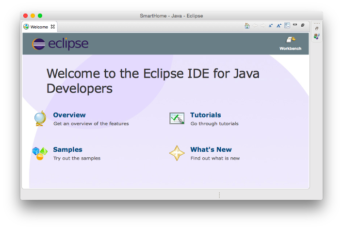
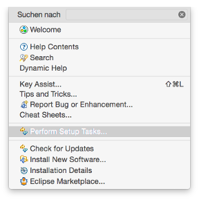
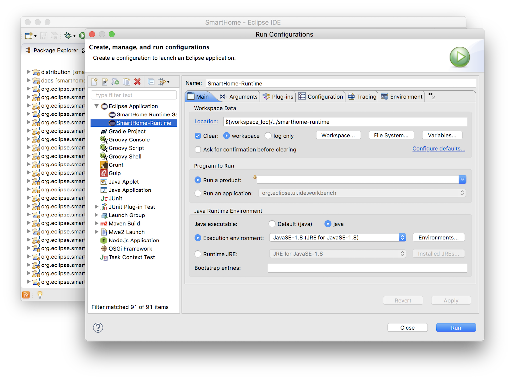



# Setting Up a Development Environment

Please ensure that you have the following prerequisites installed on your machine:

1. [Git](https://git-scm.com/downloads)
1. [Maven 3.x](https://maven.apache.org/download.cgi)
1. [Oracle JDK 8](http://www.oracle.com/technetwork/java/javase/downloads/jdk8-downloads-2133151.html)

The Eclipse IDE is used for Eclipse SmartHome developments. The Eclipse Installer automatically prepares the IDE so that it comes with all required plug-ins, the correct workspace encoding settings, pre-configured code formatters and more. Simply follow these steps:

1. Download the [Eclipse Installer](https://wiki.eclipse.org/Eclipse_Installer)
2. Launch the Eclipse Installer and switch to „Advanced Mode“ in the top right menu:

3. Choose the "Eclipse IDE for Java Developers" and select "Next":

4. Expand the "SmartHome" entry, double click "Runtime and Designer" and select "Next":

5. Now provide an installation folder and your Github id (used to push your changesets to) and select "Next":

6. The installation will now begin when pressing "Finish".

7. Once it is done, you will see the Eclipse Welcome Screen, which you can close by clicking "Workbench" on the top right. You will see that the installer not only set up an Eclipse IDE instance for you, but also checked out the Eclipse SmartHome git repository and imported all projects into the workspace. Don't worry that you still see error markers at that point, this will be addressed in the next steps.

8. Now select "Help->Perform Setup Tasks..." from the menu and click "Finish":

9. To remove the very last errors in the workspace, run a "project clean" on all projects that still show errors:

10. Your workspace should now fully compile and you can start the runtime by launching the "SmartHome Runtime" launch configuration:

11. Note: The Paper UI and Basic UI do not work at this point yet. You should run a "mvn clean install" from the root of your repository first. Afterwards, access the Paper UI at [http://localhost:8080/paperui/index.html](http://localhost:8080/paperui/index.html). For more information about Paper UI see [Paper UI Development](notes.html#paperui-development-jshtml). 

Note that you will find the sources in a subfolder called "git" within your selected installation folder. You can use any kind of git client here, if you do not want to use the git support from within the Eclipse IDE.
If you want to push changes, you need to do so to [your personal fork of the Eclipse SmartHome repository](https://github.com/eclipse/smarthome/fork) in order to create a pull request. You will find more details in the ["How to contribute"](../community/contributing.html) documentation.
