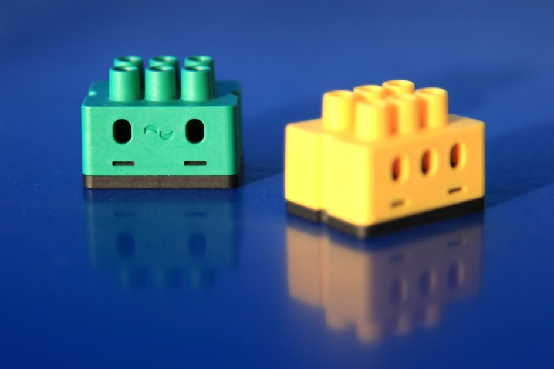



# digitalSTROM Binding

  This binding integrates the [digitalSTROM-System](http://www.digitalstrom.de/).
The integration happens through the digitalSTROM-Server, which acts as a gateway to connect the digitalSTROM-Devices. The digitalSTROM-Server communicates through the digitalSTROM-Meters with the digitalSTROM-Devices, which are directly connected to the power-line.

**Note:** All was tested with digitalSTROM-Server firmware version 1.9.3 to 1.10.3.



## Supported Things

### digitalSTROM-Server

The digitalSTROM-Server is required for accessing any other digitalSTROM-Devices. It acts like a *"bridge"*.

### digitalSTROM-Devices

At this point almost all available **GE**, **SW** and **GR** digitalSTROM-Devices with a set output-mode, unequal *disabled* or *PWM*, are supported by this binding.  
For that there are identically named thing types. Only the *GR* type has a channel (shade), which cannot be changed. The other two types add their channels dynamically affected by the set color-group and output-mode. They also automatically change or add the channels, if the color-group or output-mode has changed through the dSS-web-configuration or the configured sensor priorities of the thing have changed.

The following table shows all tested digitalSTROM-Devices with their output-modes.

| HW-Type | Output-Mode    | Tested color group  |
|-----------------|------------------------|--------------|----------------- |------------- |
| GE-KL200 | switched | yellow  |
| GE-KM200 |     switched, dimmed | yellow |
| GE-TKM210    | switched, dimmed | yellow |
| GE-SDM200 | switched, dimmed | yellow |
| GE-UMV200 | 1-10V dimmed | yellow |
| GR-KL200    | standard output-mode | grey |    
| GR-KL210    | standard output-mode| grey |
| GR-KL220    | standard output-mode | grey |
| SW-KL200    | switch, powersave, wipe | black, yellow |
| SW-UMR200    | single switched, combined switch, combined 2 stage switch, combined 3 stage switch | yellow , black |
| SW-ZWS200    | switch, powersave, wipe | black, yellow |

### digitalSTROM-Scenes

Furthermore the digitalSTROM-Scene concept is part of the digitalSTROM-Binding. These scenes are implemented as virtual things. The different scene thing types are listed in the following table.

| Thing-Type-ID | Label    | Description |
|-----------------|------------------------|--------------|----------------- |------------- |
| appScene  | Apartment-Scene | Represents a digitalSTROM Apartment-Scene.  |
| zoneScene  | Zone-Scene | Represents a digitalSTROM Zone-Scene.  |
| groupScene  | Group-Scene | Represents a digitalSTROM Group-Scene.  |
| namedScene  | Named-Scene | Represents a digitalSTROM Scene, which has a user-defined name.  |
 
## Discovery

The digitalSTROM-Server is discovered by mDNS or *dss.local.* at the local network. Once the server is added as a thing, you have to set a user name and password or insert a valid Application-Token to authenticate with the server. If the binding is authorized, it automatically reads all supported devices, that are set up on the digitalSTROM-System and puts them into the *inbox*.
 
digitalSTROM-Scenes can be discovered, too. The background scene-discovery is deactivated by default to not flood the inbox. Otherwise it will discover so many scenes, that it can be difficult to find the searched devices.
 
Discoverable scenes are all user named scenes, group scenes that are reachable by local push-buttons, zone scenes and apartment scenes. The discovery also will discover all called scenes, if they aren't automatically discovered yet.

If you only want to discover one of the thing types, you can start a discovery scan on the thing type you wish have discovered. You can use the command line command, e.g.: ``smarthome:discovery start digitalstrom:namedScene`` to start the scan. To find out what thing types this binding supports please have a look at the **Supported Things** section.

## digitalSTROM-Scenes

### General

The device scene configuration will be saved persistently to the things to update the device state faster. For that each scene configuration of each device has to read out first, because of the digitalSTROM-rule 9 that requires a waiting period of one minute, that take some time so that at the first start a scene call can take some time to read it out and update the device state. To read it out faster only the discovered or called scenes will be read out. 
 
**Note:**
Because the digitalSTROM-Server can't inform the binding about save scene events at this time, the persistently saved scene configurations can't be updated. The current troubleshooting to read out the new scene configuration after a save scene action at the digitalSTROM-Server is the following:

1. delete the thing to delete the persistently saved scene configuration
2. restart the server to delete the temporary saved scene configuration 
3. add the thing again to read out the scene configuration again.   

## Thing Configuration

### digitalSTROM-Server

The digitalSTROM-Server thing has the following configuration parameter groups: *Connection configuration*, *Server information* and *General configurations*.

#### Connection configuration

If the digitalSTROM-Server isn’t found automatically, e.g. because the server isn’t placed at the local network or the mDNS-service is deactivated, you have to insert the network address or URL and the authentication data manually through the graphical user interface or type it into the \*.thing with textual configuration.

| Parameter Label | Parameter ID | Description  | Required | Advanced 
|-----------------|------------------------|--------------|----------------- |------------- |
| Network address | ipAddress | Network address of the digitalSTROM-Server.| true | false |
| User name | userName | Name of a registered user to authenticate to the digitalSTROM-Server.| user name and password or Application-Token | false |
| Password | password | Password of a registered user to authenticate to the digitalSTROM-Server. | user name and password or Application-Token | false |
| Application-Token | applicationToken | The Application-Token to authenticate to the digitalSTROM-Server. | user name and password or Application-Token| false |

#### Server information
 
The parameter group *Server information* only includes informative parameters, which have no special functionality.


| Parameter Label | Parameter ID| Description  | Required | Advanced 
|-----------------|------------------------|--------------|----------------- |------------- |
| dSID | dSID | The unique identifier of a digitalSTOM-server. | false| false |
| digitalSTROM-Installation name | dsName | The user defined name of the digitalSTROM-Installation. | false | false | false |

#### General configuration:

Here you can set general binding configuration parameters, which are shown in following table: 

| Parameter Label | Parameter ID| Description  | Required | Advanced | default 
|-----------------|------------------------|--------------|----------------- |------------- | ----------------- |
| Sensor update interval | sensorDataUpdateInterval | Sets the seconds after the digitalSTROM-Device sensor data will be updated. If the priority is higher than 'never'. | false | false | 60 |
| Total power update interval | totalPowerUpdateInterval | Sets the interval in seconds, after the digitalSTROM total power consumption and total electric meter sensor data will be updated. | false | false | 30 |
| Days to be slaked trash bin devices | defaultTrashBinDeleateTime| Sets the days after the temporary saved digitalSTROM-Device configuration from not reachable digitalSTROM-Devices get permanently deleted. | false | false | 7 |
| Wait time sensor reading | sensorWaitTime| Waiting time between the evaluation of the sensor values and the reading of the scenes in seconds. **ATTENTION:** digitalSTROM rule 8 and 9 require a waiting period of 1 minute. Values less than 60 seconds could affect the digitalSTROM system. | false | true | 60 | 

At the thing file, a manual configuration looks e.g. like

```
Bridge digitalstrom:dssBridge:dssBridge1 [ ipAddress="dss.local.",  userName="dssadmin", password=“dssadmin", sensorDataUpdateIntervall="180"]
```

### digitalSTROM-Devices

The digitalSTROM-Device things have the following configuration parameter groups *Device information* and *Sensor setup*.
   
#### Device information

Each digitalSTROM-Device needs the device ID named dSID as a configuration parameter. The device ID is printed as a serial number at the digitalSTOM-Device and can also be found within the web-interface of the digitalSTROM-Server. 
Furthermore a supported digitalSTROM-Device has only informative parameter at this point.
The following table shows all parameters: 

| Parameter Label | Parameter ID| Description  | Required | Advanced 
|-----------------|------------------------|--------------|----------------- |------------- |
| ID | dSID| The unique identifier of a digitalSTOM-device. | true | false |
| UID | dSUID | The unique identifier of a digitalSTOM-device with virtual devices. | false | false | 
| Name | deviceName | The name of a digitalSTROM-Device. | false | false |   
| Meter dSID | meterDSID | Identifier of the meter to which the device is connected. | false | false |   
| Device hardware type | hwInfo | The hardware type from this digitalSTROM-Device. | false | false |   
| Zone ID | zoneID |The digitalSTROM-Device is part of this zone. | false | false |   
| Group ID's | groups | The digitalSTROM-Device is part of this user-defined or functional groups. | false | false |   
| Output mode | output mode | The current digitalSTROM-Device output mode e.g. 22 = dimmable. | false | false |   
| Functional color group | funcColorGroup | The current digitalSTROM-Device functional color group e.g. yellow = light. | false | false |   

#### Sensor setup

The GE and SW digitalSTROM-Devices usually have sensors to capture power consumption data. So these devices have the following parameters to read them out.  

| Parameter Label | Parameter ID| Description  | Required | Advanced | Default |
|-----------------|------------------------|--------------|----------------- |------------- | -----------|
| Active power refresh priority | activePowerRefreshPriority | Sets the refresh priority for the active power sensor value. Can be never, low priority, medium priority or high priority. | false | false | never |
| Electric meter refresh priority | electricMeterRefreshPriority | Sets the refresh priority for the electric meter sensor value. Can be never, low priority, medium priority or high priority. | false | false | never |
| Output current refresh priority | outputCurrentRefreshPriority | Sets the refresh priority for the output current sensor value. Can be never, low priority, medium priority or high priority. | false | false | never |

### digitalSTROM-Scenes

The digitalSTROM-Scenes can be defined with following parameters.  

| Parameter Label | Parameter ID| Description  | Required | Advanced | 
|-----------------|------------------------|--------------|----------------- |------------- |
| Scene name | sceneName | The name of a digitalSTROM scene. | false | false |
| Zone ID or name | zoneID | The zone ID or zone name of the called scene. 0 or empty is broadcast to all. | false | false | 
| Group ID or name | groupID | The group ID or group name of the called scene. 0 or empty is broadcast to all. | false | false | 
| Scene ID or name | sceneID |The call scene ID or scene name, e.g. preset 1 for scene ID 5. Callable scenes are from 0 to 126. | false | false | 

The Scene-Thing-Type *Named-Scene* and *Group-Scene* have all parameters. The *Apartment-Scene* only has the parameters *Scene name* and *Scene ID* an the *Zone-Scene* has all parameters without *Group ID or name*. 

Usually the discovery works reliably, so that a manual configuration is not needed.

However, at the thing file, a manual configuration looks e.g. like 

```
Thing digitalstrom:GE:GE-KM200 [ dSID="´3504175fe0000000000043d4",  activePowerRefreshPriority="low", electricMeterRefreshPriority=“medium", outputCurrentRefreshPriority="high"]

Thing digitalstrom:GR:GR-KM200 [ dSID="3504175fe0000000000043d5"]
```

## Channels

All devices support some of the following channels:  

| Channel Type ID | Item Type    | Description  | supported device type |
|-----------------|------------------------|--------------|----------------- |------------- |
| brightness| Dimmer | The brightness channel allows to dimm a light device.  | GE, SW | 
| lightSwitch | Switch | The light switch channel allows to turn a light device on or off. | GE, SW | 
| combined2StageSwitch | String| The 2 stage light switch channel allows to turn both light devices on or off or switch only 1 of the both light devices on or off. | SW-UMR200 | 
| combined3StageSwitch | String | The 3 stage light switch channel allows to turn both light devices on or off or switch both light devices separated from each other on or off. | SW-UMR200 | 
| shade | Rollershutter | The shade control channel allows to control shade device e.g. a roller shutter or awnings. | GR |
| shadeAngle | Dimmer | The slat control channel allows to control the relative slat position in percent of blinds. | GR | 
| generalDimm | Dimmer | The device power control channel allows to control the power of a device e.g. a ceiling fan. | SW | 
| generalSwitch | Switch | The device switch channel allows to turn a device on or off e.g. a HIFI-System. | SW | 
| generalCombined3StageSwitch  | String | The 2 stage device switch channel allows to turn both relays of the device on or off or switch only 1 of the both relais on or off. | SW-UMR200 | 
| generalCombined3StageSwitch  | String | The 3 stage device channel allows to turn both relays of the device on or off or switch both relais of the device separated from each other on or off. | SW-UMR200 | 
| activePower | Number | The active power channel indicates the current active power in watt (W) of the device. | GE, SW | 
| outputCurrent | Number | The output current channel indicates the current output current in ampere (A) of the device. | GE, SW | 
| electricMeter | Number | The electric meter channel indicates the current electric meter value in kilowatts hours (kWh) of the device. | GE, SW | 
| totalActivePower |  | The total power consumption channel indicates the current consumption power in watt (W)  of all connected circuits to the digitalSTROM-System. | dssBridge | 
| totalElectricMeter | Number | The total electric meter channel indicates the current electric meter value in killowatt hours of all connected circuits to the digitalSTROM-System. | dssBridge  | 
| scene | Switch | The scene channel allows to call or undo a scene from digitalSTROM. | Scene | 

**Notes:**

*Channels with accepted command type increase and decrease:*

  * digitalSTROM will only evaluate increase and decrease commands, if a scene was called before which turn the device on. 
   
*Blinds:*

 * Increase, decrease and up, down commands of the shade channel changes the angle in digitalSTROM, too. If you want to set only the position, you have to set the value directly.
 * To protect the slats digitalSTROM changes the position by setting the angle, too, if the position is very high or low. So if you want to see the correct position, you have to send a refresh or stop command, if the blind is ready. 

## Full Example

demo.things:

```
Bridge digitalstrom:dssBridge:1 [ ipAddress="dss.local.",  userName="dssadmin", password="dssadmin", sensorDataUpdateIntervall=180] {
    GE GE-KM200 [ dSID="3504175fe0000000000043d4",  ActivePowerRefreshPriority="low", ElectricMeterRefreshPriority="medium", OutputCurrentRefreshPriority="high"]
    GR GR-KM200 [ dSID="3504175fe0000000000043d5"]
    namedScene scene1 [zoneID="0", groupID="0", sceneID="5"]
}
```

demo.items:

```
Dimmer Brightness { channel="digitalstrom:GE:GE-KM200-1:brightness" }
Number ActivePower { channel="digitalstrom:GE:GE-KM200-1:activePower" }
Number OutputCurrent { channel="digitalstrom:GE:GE-KM200-1:outputCurrent" }
Number ElectricMeter { channel="digitalstrom:GE:GE-KM200-1:electricMeter" }

Number TotalActivePower { channel="digitalstrom:dssBridge:dssBridge1:totalActivePower" }
Number TotalElectricMeter { channel="digitalstrom:dssBridge:dssBridge1:totalElectricMeter" }


Rollershutter Shade { channel="digitalstrom:GR:GR-KM200-1:shade" }

Switch Scene { channel="digitalstrom:namedScene:scene1:scene" }
```

demo.sitemap:

```
sitemap demo label="Main Menu"
{
    Frame {
        Slider item=Brightness 
        Switch item=Brightness
        Text item=ActivePower 
        Text item=OutputCurrent 
        Text item=ElectricMeter 
    }
    Frame {
        Text item=TotalActivePower 
        Text item=TotalElectricMeter 
    }
    Frame {
        Switch item=Scene 
    }
    Frame {
        Slider item=Shade 
    }
}
```
