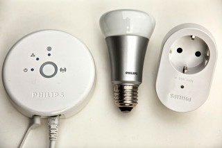



# Philips Hue Binding

This binding integrates the [Philips Hue Lighting system](http://www.meethue.com).
The integration happens through the Hue bridge, which acts as an IP gateway to the ZigBee devices.




## Supported Things

The Hue bridge is required as a "bridge" for accessing any other Hue devies.

Almost all available Hue devices are supported by this binding. This includes not only the "friends of Hue", but also products like the LivingWhites adapter. Additionally, it is possible to use Osram Lightify bulbs as well as other ZigBee LightLink compatible products like e.g. the [GE bulb](http://gelinkbulbs.com/). Please note that the devices need to be registered with the Hue bridge before it is possible for this binding to use them.

The hue binding supports all five types of lights of the Hue system: [Supported lights](http://www.developers.meethue.com/documentation/supported-lights). These are: 

| Light type | ZigBee Device ID | Thing type |
|------------|------------------|------------|
| On/off light | 0x0000 | on_off_light |
| Dimmable light | 0x0100 | dimmable_light |
| Color temperature light | 0x0220 | color_temperature_light | 
| Color light | 0x0200 | color_light | 
| Extended Color light | 0x0210 | extended_color_light |

All different models of Hue or Osram bulbs nicely fit into one of these five categories. 

## Discovery

The Hue bridge is discovered through UPnP in the local network. Once it is added as a Thing, its authentication button (in the middle) needs to be pressed in order to authorize the binding to access it. Once the binding is authorized, it automatically reads all devices that are set up on the Hue bridge and puts them in the Inbox.

## Thing Configuration

The Hue bridge requires the ip address as a configuration value in order for the binding to know where to access it.
In the thing file, this looks e.g. like
```
Bridge hue:bridge:1 [ ipAddress="192.168.0.64" ]
```
A user to authenticate against the Hue bridge is automatically generated. Please note that the generated user name cannot be written automatically to the .thing file, and has to be set manually. The generated user name can be found in the log files after pressing the authentication button on the bridge.
The user name can be set using the `userName` configuration value, e.g.:

```
Bridge hue:bridge:1 [ ipAddress="192.168.0.64", userName="qwertzuiopasdfghjklyxcvbnm1234" ]
```

The bulbs are identified by the number that the Hue bridge assigns to them (also shown in the Hue app as an identifier).
Thus, all if needs for manual configuration is this single value like
```
extended_color_light bulb1 [ lightId="1" ]
```

## Channels

All devices support some of the following channels:

| Channel Type ID | Item Type    | Description  | Thing types supporting this channel | 
|-----------------|------------------------|--------------|----------------- |------------- |---------|
| color | Color       | This channel supports full color control with hue, saturation and brightness values. | color_light, extendend_color_light | 
| brightness | Dimmer       | This channel supports adjusting the brightness value. Note that this is not available, if the color channel is supported. | dimmable_light, color_light, extended_color_light, color_temperature_light | 
| color_temperature | Dimmer       | This channel supports adjusting the color temperature from cold (0%) to warm (100%) | extended_color_light, color_temperature_light |
| alert | Option | This channel supports displaying alerts by flashing the bulb either once opr multiple times. Valid options are: None, Alert, Long Alert | on_off_light, dimmable_light, color_light, extended_color_light, color_temperature_light |
| effect | Switch | This channel supports color looping. | color_light, extended_color_light, color_temperature_light |

## Full Example

demo.things:

```
Bridge hue:bridge:1 [ ipAddress="192.168.0.64" ] {
	extendend_color_light bulb1 [ lightId="1" ]
}
```

demo.items:

```
Color Light { channel="hue:extended_color_light:1:bulb1:color" }
Dimmer Light_ColorTemp { channel="hue:extended_color_light:1:bulb1:color_temperature" }
```

demo.sitemap:

```
sitemap demo label="Main Menu"
{
	Frame {
		Colorpicker item=Light
		Slider item=Light_ColorTemp
	}
}
```
