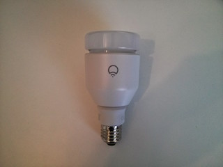



# LIFX Binding

This binding integrates the [LIFX LED Bulb](http://www.lifx.com/). All LIFX bulbs are directly connected to the WLAN and the binding communicates with them over a UDP protocol.



## Supported Things

The binding was mainly developed for the E27 original LIFX bulb. Other bulbs like the GU10 model are not tested, but should also be supported. 

## Discovery

The binding is able to auto-discover all bulbs in a network over the LIFX UDP protocol. Therefore all bulbs must be turned on.

*Note:* To get the binding working, all bulbs must be added to the WLAN network first with the help of the [LIFX smart phone applications](http://www.lifx.com/pages/go). The binding is NOT able to add or detect bulbs outside the network.

## Thing Configuration

Each bulb needs the device ID as a configuration parameter. The device ID is printed as a serial number on the bulb and can also be found within the native LIFX Android or iOS application. But usually the discovery works quite reliably, so that a manual configuration is not needed.

However, in the thing file, a manual configuration looks e.g. like

```
Thing lifx:light:light1 [ deviceId="D073D5010E20" ]
```

## Channels

The bulb only supports the color channel:

| Channel Type ID | Item Type    | Description  |
|-----------------|------------------------|--------------|----------------- |------------- |
| color | Color       | This channel supports full color control with hue, saturation and brightness values. |


## Full Example

demo.things:

```
Thing lifx:light:light1 [ deviceId="D073D5010E20" ]
```

demo.items:

```
Color Light { channel="lifx:light:light1:color" }
```

demo.sitemap:

```
sitemap demo label="Main Menu"
{
	Frame {
		Colorpicker item=Light
	}
}
```
