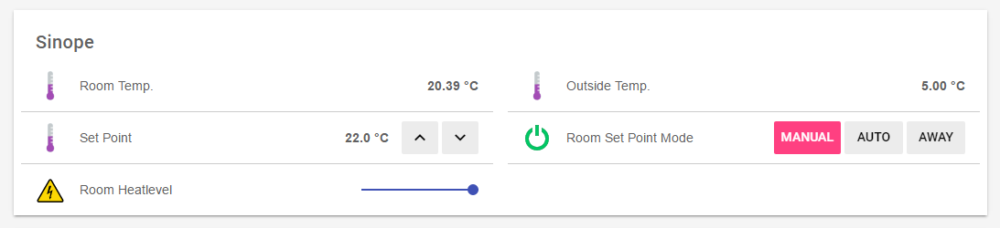

# OpenHab2 / Eclipse SmartHome Bindings for Sinope device. 

This binding supports [OpenHab 2](<http://www.openhab.org/>) and [Eclipse SmartHome API] (<https://www.eclipse.org/smarthome/index.html>). The integration happens through the Sinope (GT150) bridge, which acts as an IP gateway to the Sinope devices on the 916 Mhz ISM band.

This binding supports multiple gateways with multiple devices.

---
layout: documentation
---


## Supported Things

The Sinope bridge is required as a "bridge" for accessing any other Sinope  devices.

Right-now, only the thermostat devices (3000W and 4000W) (TH1120RF) are supported. The whole framework is in-place. It fairly easy to integrate other devices. (I accept donation :))


## Discovery

The Sinope Gateway (bridge) is not supported for now. It will be added in future release.
The Sinope devices discovery is also not supported for now but it is already in development but it requires some testing. It will be committed shortly.

## Prerequisites


### Bridge or the Sinope Gateway 
First, you will need to get your api key from your Sinope gateway.

Grab the latest release of the [sinope-core library](<https://github.com/chaton78/sinope-core/releases>)

For Windows platform, you can run the SinopeProtocol.exe (in the zip release). The gateway parameter is written on the back of the SinopeGateway (example, 002f-c2c2-dd88-aaaa). The addr parameter is the ip given to your gateway.

```
SinopeProtocol.exe -addr [YOUR_GATEWAY_IP_OR_HOSTNAME]  -gateway [YOUR_GATEWAY_ID] -login
Getting API Key  - PRESS WEB Button
Your api Key is: 0x12 0x57 0x55 0xD5 0xCD 0x4A 0xD5 0x33

```
Alternatively, on a non-windows or using only a jvm, you can invoke directly the java command:
```
java -jar core-0.0.3-shaded.jar -addr [YOUR_GATEWAY_IP_OR_HOSTNAME]   -gateway [YOUR_GATEWAY_ID] -login
Getting API Key  - PRESS WEB Button
Your api Key is: 0x12 0x57 0x55 0xD5 0xCD 0x4A 0xD5 0x33

```
### Thing or device discovery

You can use the same procedure to discover each you want to use. You will need to provide the api key from the previous step. If you uses spaces, please, use double quotes to pass the api key (i.e. "0x12 0x57 0x55 0xD5 0xCD 0x4A 0xD5 0x33") 

Use the device procedure to discover it. For a thermostat, you need to push both buttons. The application will loop forever, press ctrl-c to exit.

```
SinopeProtocol.exe -addr [YOUR_GATEWAY_IP_OR_HOSTNAME]  -gateway [YOUR_GATEWAY_ID] -api "[YOUR_API_KEY]" -discover

It is now time to push both buttons on your device!
Press crtl-c to exit!
Your device id is: 0x00 0x00 0x35 0x86
It is now time to push both buttons on your device!
Press crtl-c to exit!
```
Again, on a non-windows or using only a jvm, you can invoke directly the java command:

```
java -jar core-0.0.3-shaded.jar -addr [YOUR_GATEWAY_IP_OR_HOSTNAME]  -gateway [YOUR_GATEWAY_ID] -api "[YOUR_API_KEY]" -discover

It is now time to push both buttons on your device!
Press crtl-c to exit!
Your device id is: 0x00 0x00 0x35 0x86
It is now time to push both buttons on your device!
Press crtl-c to exit!
```


## Thing Configuration

The Sinope bridge requires the address, the gateway id and the api key in order for the binding to know where and how to access it.
In the thing file, this looks e.g. like

```
Bridge sinope:gateway:home [ hostname="[YOUR_GATEWAY_IP_OR_HOSTNAME]", gatewayId="[YOUR_GATEWAY_ID]", apiKey="0x1F 0x5D 0xC8 0xD5 0xCD 0x3A 0xD7 0x23"]
```


The devices are identified by the id that the Sinope device return when you discovered it.


```
thermostat room [ deviceId = "0x00 0x00 0x35 0x86" ]
```

## Channels

All devices support some of the following channels:

 Channel Type ID     | Item Type   | Description                                                                                                                            
---------------------|-------------|----------------------------------------------------------------------------------------------------------------------------------------|
 insideTemperature   | Number (R)  | Inside Temperature                                                                                                                     |   
 outsideTemperature  | Number (R)  | Outside Temperature                                                                                                                    | 
 setPointTemperature | Number (RW) | Set Point Temperature                                                                                                                  | 
 setPointMode        | String (RW) | Thermostat set point mode                                                                                                              |     
 heatLevel           | Number (R)  | Heat Level                                                                                                                             | 

## Full Example

In this example setup the Sinope Gateway as a Bridge **Home** with thermostat **Room**

### demo.things:

```
Bridge sinope:gateway:home [ hostname="sinope", gatewayId="1234-4567-1234-1234", apiKey="0x12 0x34 0x56 0x78 0x9A 0xBC 0xDE 0xF0"] {
    thermostat room [ deviceId = "00003586" ]
}
```

### demo.items:

```
Number Room_In               "Room Temp. [%.2f °C]"         <temperature> { channel="sinope:thermostat:home:room:insideTemperature" }
Number Room_Out              "Outside Temp. [%.2f °C]"      <temperature> { channel="sinope:thermostat:home:room:outsideTemperature" }
Number Room_SetPoint         "Room Set Point [%.2f °C]"     <temperature> { channel="sinope:thermostat:home:room:setPointTemperature" }
String Room_SetPointMode     "Room Set Point Mode"                        { channel="sinope:thermostat:home:room:setPointMode" }
Number Room_HeatLevel        "Room Heatlevel [%d]"          <energy>      { channel="sinope:thermostat:home:room:heatLevel" }
```


### demo.sitemap:

```
sitemap demo label="Main Menu"
{ 
  Frame label="Sinope" {
     Text item=Room_In   
     Text item=Room_Out
     Setpoint item=Room_SetPoint  label="Set Point [%.1f °C]" step=0.5 minValue=5 maxValue=35
     Switch item=Room_SetPointMode mappings=[2=Manual, 3=Auto, 5=Away]
     Slider item=Room_HeatLevel
  
  }
}
  
```

### UI Example

