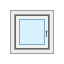
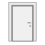
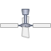
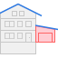
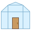
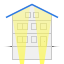

# Classic Icon Set

This is a modernized version of the original icon set from openHAB 1.x.
The set is provided with the distribution in both the PNG and SVG file format.

  <figure style="width: 128px; display: inline-block; text-align: center; font-size: 0.8em; margin: 16px 8px;">
    
    <figcaption>alarm</figcaption>
  </figure>
  <figure style="width: 128px; display: inline-block; text-align: center; font-size: 0.8em; margin: 16px 8px;">
    
    <figcaption>attic</figcaption>
  </figure>
  <figure style="width: 128px; display: inline-block; text-align: center; font-size: 0.8em; margin: 16px 8px;">
    
    <figcaption>baby_1</figcaption>
  </figure>
  <figure style="width: 128px; display: inline-block; text-align: center; font-size: 0.8em; margin: 16px 8px;">
    
    <figcaption>baby_2</figcaption>
  </figure>
  <figure style="width: 128px; display: inline-block; text-align: center; font-size: 0.8em; margin: 16px 8px;">
    
    <figcaption>baby_3</figcaption>
  </figure>
  <figure style="width: 128px; display: inline-block; text-align: center; font-size: 0.8em; margin: 16px 8px;">
    
    <figcaption>baby_4</figcaption>
  </figure>
  <figure style="width: 128px; display: inline-block; text-align: center; font-size: 0.8em; margin: 16px 8px;">
    
    <figcaption>baby_5</figcaption>
  </figure>
  <figure style="width: 128px; display: inline-block; text-align: center; font-size: 0.8em; margin: 16px 8px;">
    
    <figcaption>baby_6</figcaption>
  </figure>
  <figure style="width: 128px; display: inline-block; text-align: center; font-size: 0.8em; margin: 16px 8px;">
    
    <figcaption>bath</figcaption>
  </figure>
  <figure style="width: 128px; display: inline-block; text-align: center; font-size: 0.8em; margin: 16px 8px;">
    
    <figcaption>battery</figcaption>
  </figure>
  <figure style="width: 128px; display: inline-block; text-align: center; font-size: 0.8em; margin: 16px 8px;">
    
    <figcaption>battery-0</figcaption>
  </figure>
  <figure style="width: 128px; display: inline-block; text-align: center; font-size: 0.8em; margin: 16px 8px;">
    
    <figcaption>battery-10</figcaption>
  </figure>
  <figure style="width: 128px; display: inline-block; text-align: center; font-size: 0.8em; margin: 16px 8px;">
    
    <figcaption>battery-20</figcaption>
  </figure>
  <figure style="width: 128px; display: inline-block; text-align: center; font-size: 0.8em; margin: 16px 8px;">
    
    <figcaption>battery-30</figcaption>
  </figure>
  <figure style="width: 128px; display: inline-block; text-align: center; font-size: 0.8em; margin: 16px 8px;">
    
    <figcaption>battery-40</figcaption>
  </figure>
  <figure style="width: 128px; display: inline-block; text-align: center; font-size: 0.8em; margin: 16px 8px;">
    
    <figcaption>battery-50</figcaption>
  </figure>
  <figure style="width: 128px; display: inline-block; text-align: center; font-size: 0.8em; margin: 16px 8px;">
    
    <figcaption>battery-60</figcaption>
  </figure>
  <figure style="width: 128px; display: inline-block; text-align: center; font-size: 0.8em; margin: 16px 8px;">
    
    <figcaption>battery-70</figcaption>
  </figure>
  <figure style="width: 128px; display: inline-block; text-align: center; font-size: 0.8em; margin: 16px 8px;">
    
    <figcaption>battery-80</figcaption>
  </figure>
  <figure style="width: 128px; display: inline-block; text-align: center; font-size: 0.8em; margin: 16px 8px;">
    
    <figcaption>battery-90</figcaption>
  </figure>
  <figure style="width: 128px; display: inline-block; text-align: center; font-size: 0.8em; margin: 16px 8px;">
    
    <figcaption>battery-100</figcaption>
  </figure>
  <figure style="width: 128px; display: inline-block; text-align: center; font-size: 0.8em; margin: 16px 8px;">
    
    <figcaption>battery-off</figcaption>
  </figure>
  <figure style="width: 128px; display: inline-block; text-align: center; font-size: 0.8em; margin: 16px 8px;">
    
    <figcaption>battery-on</figcaption>
  </figure>
  <figure style="width: 128px; display: inline-block; text-align: center; font-size: 0.8em; margin: 16px 8px;">
    
    <figcaption>bedroom</figcaption>
  </figure>
  <figure style="width: 128px; display: inline-block; text-align: center; font-size: 0.8em; margin: 16px 8px;">
    
    <figcaption>bedroom_blue</figcaption>
  </figure>
  <figure style="width: 128px; display: inline-block; text-align: center; font-size: 0.8em; margin: 16px 8px;">
    
    <figcaption>bedroom_orange</figcaption>
  </figure>
  <figure style="width: 128px; display: inline-block; text-align: center; font-size: 0.8em; margin: 16px 8px;">
    
    <figcaption>bedroom_red</figcaption>
  </figure>
  <figure style="width: 128px; display: inline-block; text-align: center; font-size: 0.8em; margin: 16px 8px;">
    
    <figcaption>blinds</figcaption>
  </figure>
  <figure style="width: 128px; display: inline-block; text-align: center; font-size: 0.8em; margin: 16px 8px;">
    
    <figcaption>blinds-0</figcaption>
  </figure>
  <figure style="width: 128px; display: inline-block; text-align: center; font-size: 0.8em; margin: 16px 8px;">
    
    <figcaption>blinds-10</figcaption>
  </figure>
  <figure style="width: 128px; display: inline-block; text-align: center; font-size: 0.8em; margin: 16px 8px;">
    
    <figcaption>blinds-20</figcaption>
  </figure>
  <figure style="width: 128px; display: inline-block; text-align: center; font-size: 0.8em; margin: 16px 8px;">
    
    <figcaption>blinds-30</figcaption>
  </figure>
  <figure style="width: 128px; display: inline-block; text-align: center; font-size: 0.8em; margin: 16px 8px;">
    
    <figcaption>blinds-40</figcaption>
  </figure>
  <figure style="width: 128px; display: inline-block; text-align: center; font-size: 0.8em; margin: 16px 8px;">
    
    <figcaption>blinds-50</figcaption>
  </figure>
  <figure style="width: 128px; display: inline-block; text-align: center; font-size: 0.8em; margin: 16px 8px;">
    
    <figcaption>blinds-60</figcaption>
  </figure>
  <figure style="width: 128px; display: inline-block; text-align: center; font-size: 0.8em; margin: 16px 8px;">
    
    <figcaption>blinds-70</figcaption>
  </figure>
  <figure style="width: 128px; display: inline-block; text-align: center; font-size: 0.8em; margin: 16px 8px;">
    
    <figcaption>blinds-80</figcaption>
  </figure>
  <figure style="width: 128px; display: inline-block; text-align: center; font-size: 0.8em; margin: 16px 8px;">
    
    <figcaption>blinds-90</figcaption>
  </figure>
  <figure style="width: 128px; display: inline-block; text-align: center; font-size: 0.8em; margin: 16px 8px;">
    
    <figcaption>blinds-100</figcaption>
  </figure>
  <figure style="width: 128px; display: inline-block; text-align: center; font-size: 0.8em; margin: 16px 8px;">
    
    <figcaption>bluetooth</figcaption>
  </figure>
  <figure style="width: 128px; display: inline-block; text-align: center; font-size: 0.8em; margin: 16px 8px;">
    
    <figcaption>boiler_viessmann</figcaption>
  </figure>
  <figure style="width: 128px; display: inline-block; text-align: center; font-size: 0.8em; margin: 16px 8px;">
    
    <figcaption>boy_1</figcaption>
  </figure>
  <figure style="width: 128px; display: inline-block; text-align: center; font-size: 0.8em; margin: 16px 8px;">
    
    <figcaption>boy_2</figcaption>
  </figure>
  <figure style="width: 128px; display: inline-block; text-align: center; font-size: 0.8em; margin: 16px 8px;">
    
    <figcaption>boy_3</figcaption>
  </figure>
  <figure style="width: 128px; display: inline-block; text-align: center; font-size: 0.8em; margin: 16px 8px;">
    
    <figcaption>boy_4</figcaption>
  </figure>
  <figure style="width: 128px; display: inline-block; text-align: center; font-size: 0.8em; margin: 16px 8px;">
    
    <figcaption>boy_5</figcaption>
  </figure>
  <figure style="width: 128px; display: inline-block; text-align: center; font-size: 0.8em; margin: 16px 8px;">
    
    <figcaption>boy_6</figcaption>
  </figure>
  <figure style="width: 128px; display: inline-block; text-align: center; font-size: 0.8em; margin: 16px 8px;">
    
    <figcaption>calendar</figcaption>
  </figure>
  <figure style="width: 128px; display: inline-block; text-align: center; font-size: 0.8em; margin: 16px 8px;">
    
    <figcaption>camera</figcaption>
  </figure>
  <figure style="width: 128px; display: inline-block; text-align: center; font-size: 0.8em; margin: 16px 8px;">
    
    <figcaption>carbondioxide</figcaption>
  </figure>
  <figure style="width: 128px; display: inline-block; text-align: center; font-size: 0.8em; margin: 16px 8px;">
    
    <figcaption>cellar</figcaption>
  </figure>
  <figure style="width: 128px; display: inline-block; text-align: center; font-size: 0.8em; margin: 16px 8px;">
    
    <figcaption>chart</figcaption>
  </figure>
  <figure style="width: 128px; display: inline-block; text-align: center; font-size: 0.8em; margin: 16px 8px;">
    
    <figcaption>cinema</figcaption>
  </figure>
  <figure style="width: 128px; display: inline-block; text-align: center; font-size: 0.8em; margin: 16px 8px;">
    
    <figcaption>cinemascreen</figcaption>
  </figure>
  <figure style="width: 128px; display: inline-block; text-align: center; font-size: 0.8em; margin: 16px 8px;">
    
    <figcaption>cinemascreen-0</figcaption>
  </figure>
  <figure style="width: 128px; display: inline-block; text-align: center; font-size: 0.8em; margin: 16px 8px;">
    
    <figcaption>cinemascreen-10</figcaption>
  </figure>
  <figure style="width: 128px; display: inline-block; text-align: center; font-size: 0.8em; margin: 16px 8px;">
    
    <figcaption>cinemascreen-20</figcaption>
  </figure>
  <figure style="width: 128px; display: inline-block; text-align: center; font-size: 0.8em; margin: 16px 8px;">
    
    <figcaption>cinemascreen-30</figcaption>
  </figure>
  <figure style="width: 128px; display: inline-block; text-align: center; font-size: 0.8em; margin: 16px 8px;">
    
    <figcaption>cinemascreen-40</figcaption>
  </figure>
  <figure style="width: 128px; display: inline-block; text-align: center; font-size: 0.8em; margin: 16px 8px;">
    
    <figcaption>cinemascreen-50</figcaption>
  </figure>
  <figure style="width: 128px; display: inline-block; text-align: center; font-size: 0.8em; margin: 16px 8px;">
    
    <figcaption>cinemascreen-60</figcaption>
  </figure>
  <figure style="width: 128px; display: inline-block; text-align: center; font-size: 0.8em; margin: 16px 8px;">
    
    <figcaption>cinemascreen-70</figcaption>
  </figure>
  <figure style="width: 128px; display: inline-block; text-align: center; font-size: 0.8em; margin: 16px 8px;">
    
    <figcaption>cinemascreen-80</figcaption>
  </figure>
  <figure style="width: 128px; display: inline-block; text-align: center; font-size: 0.8em; margin: 16px 8px;">
    
    <figcaption>cinemascreen-90</figcaption>
  </figure>
  <figure style="width: 128px; display: inline-block; text-align: center; font-size: 0.8em; margin: 16px 8px;">
    
    <figcaption>cinemascreen-100</figcaption>
  </figure>
  <figure style="width: 128px; display: inline-block; text-align: center; font-size: 0.8em; margin: 16px 8px;">
    
    <figcaption>cistern</figcaption>
  </figure>
  <figure style="width: 128px; display: inline-block; text-align: center; font-size: 0.8em; margin: 16px 8px;">
    
    <figcaption>cistern-0</figcaption>
  </figure>
  <figure style="width: 128px; display: inline-block; text-align: center; font-size: 0.8em; margin: 16px 8px;">
    
    <figcaption>cistern-10</figcaption>
  </figure>
  <figure style="width: 128px; display: inline-block; text-align: center; font-size: 0.8em; margin: 16px 8px;">
    
    <figcaption>cistern-20</figcaption>
  </figure>
  <figure style="width: 128px; display: inline-block; text-align: center; font-size: 0.8em; margin: 16px 8px;">
    
    <figcaption>cistern-30</figcaption>
  </figure>
  <figure style="width: 128px; display: inline-block; text-align: center; font-size: 0.8em; margin: 16px 8px;">
    
    <figcaption>cistern-40</figcaption>
  </figure>
  <figure style="width: 128px; display: inline-block; text-align: center; font-size: 0.8em; margin: 16px 8px;">
    
    <figcaption>cistern-50</figcaption>
  </figure>
  <figure style="width: 128px; display: inline-block; text-align: center; font-size: 0.8em; margin: 16px 8px;">
    
    <figcaption>cistern-60</figcaption>
  </figure>
  <figure style="width: 128px; display: inline-block; text-align: center; font-size: 0.8em; margin: 16px 8px;">
    
    <figcaption>cistern-70</figcaption>
  </figure>
  <figure style="width: 128px; display: inline-block; text-align: center; font-size: 0.8em; margin: 16px 8px;">
    
    <figcaption>cistern-80</figcaption>
  </figure>
  <figure style="width: 128px; display: inline-block; text-align: center; font-size: 0.8em; margin: 16px 8px;">
    
    <figcaption>cistern-90</figcaption>
  </figure>
  <figure style="width: 128px; display: inline-block; text-align: center; font-size: 0.8em; margin: 16px 8px;">
    
    <figcaption>cistern-100</figcaption>
  </figure>
  <figure style="width: 128px; display: inline-block; text-align: center; font-size: 0.8em; margin: 16px 8px;">
    
    <figcaption>climate</figcaption>
  </figure>
  <figure style="width: 128px; display: inline-block; text-align: center; font-size: 0.8em; margin: 16px 8px;">
    
    <figcaption>climate-on</figcaption>
  </figure>
  <figure style="width: 128px; display: inline-block; text-align: center; font-size: 0.8em; margin: 16px 8px;">
    
    <figcaption>clock</figcaption>
  </figure>
  <figure style="width: 128px; display: inline-block; text-align: center; font-size: 0.8em; margin: 16px 8px;">
    
    <figcaption>clock-on</figcaption>
  </figure>
  <figure style="width: 128px; display: inline-block; text-align: center; font-size: 0.8em; margin: 16px 8px;">
    
    <figcaption>colorlight</figcaption>
  </figure>
  <figure style="width: 128px; display: inline-block; text-align: center; font-size: 0.8em; margin: 16px 8px;">
    
    <figcaption>colorpicker</figcaption>
  </figure>
  <figure style="width: 128px; display: inline-block; text-align: center; font-size: 0.8em; margin: 16px 8px;">
    
    <figcaption>colorwheel</figcaption>
  </figure>
  <figure style="width: 128px; display: inline-block; text-align: center; font-size: 0.8em; margin: 16px 8px;">
    
    <figcaption>contact</figcaption>
  </figure>
  <figure style="width: 128px; display: inline-block; text-align: center; font-size: 0.8em; margin: 16px 8px;">
    
    <figcaption>contact-ajar</figcaption>
  </figure>
  <figure style="width: 128px; display: inline-block; text-align: center; font-size: 0.8em; margin: 16px 8px;">
    
    <figcaption>contact-closed</figcaption>
  </figure>
  <figure style="width: 128px; display: inline-block; text-align: center; font-size: 0.8em; margin: 16px 8px;">
    
    <figcaption>contact-open</figcaption>
  </figure>
  <figure style="width: 128px; display: inline-block; text-align: center; font-size: 0.8em; margin: 16px 8px;">
    
    <figcaption>corridor</figcaption>
  </figure>
  <figure style="width: 128px; display: inline-block; text-align: center; font-size: 0.8em; margin: 16px 8px;">
    
    <figcaption>dimmablelight</figcaption>
  </figure>
  <figure style="width: 128px; display: inline-block; text-align: center; font-size: 0.8em; margin: 16px 8px;">
    
    <figcaption>dimmablelight-0</figcaption>
  </figure>
  <figure style="width: 128px; display: inline-block; text-align: center; font-size: 0.8em; margin: 16px 8px;">
    
    <figcaption>dimmablelight-10</figcaption>
  </figure>
  <figure style="width: 128px; display: inline-block; text-align: center; font-size: 0.8em; margin: 16px 8px;">
    
    <figcaption>dimmablelight-20</figcaption>
  </figure>
  <figure style="width: 128px; display: inline-block; text-align: center; font-size: 0.8em; margin: 16px 8px;">
    
    <figcaption>dimmablelight-30</figcaption>
  </figure>
  <figure style="width: 128px; display: inline-block; text-align: center; font-size: 0.8em; margin: 16px 8px;">
    
    <figcaption>dimmablelight-40</figcaption>
  </figure>
  <figure style="width: 128px; display: inline-block; text-align: center; font-size: 0.8em; margin: 16px 8px;">
    
    <figcaption>dimmablelight-50</figcaption>
  </figure>
  <figure style="width: 128px; display: inline-block; text-align: center; font-size: 0.8em; margin: 16px 8px;">
    
    <figcaption>dimmablelight-60</figcaption>
  </figure>
  <figure style="width: 128px; display: inline-block; text-align: center; font-size: 0.8em; margin: 16px 8px;">
    
    <figcaption>dimmablelight-70</figcaption>
  </figure>
  <figure style="width: 128px; display: inline-block; text-align: center; font-size: 0.8em; margin: 16px 8px;">
    
    <figcaption>dimmablelight-80</figcaption>
  </figure>
  <figure style="width: 128px; display: inline-block; text-align: center; font-size: 0.8em; margin: 16px 8px;">
    
    <figcaption>dimmablelight-90</figcaption>
  </figure>
  <figure style="width: 128px; display: inline-block; text-align: center; font-size: 0.8em; margin: 16px 8px;">
    
    <figcaption>dimmablelight-100</figcaption>
  </figure>
  <figure style="width: 128px; display: inline-block; text-align: center; font-size: 0.8em; margin: 16px 8px;">
    
    <figcaption>door</figcaption>
  </figure>
  <figure style="width: 128px; display: inline-block; text-align: center; font-size: 0.8em; margin: 16px 8px;">
    
    <figcaption>door-closed</figcaption>
  </figure>
  <figure style="width: 128px; display: inline-block; text-align: center; font-size: 0.8em; margin: 16px 8px;">
    
    <figcaption>door-open</figcaption>
  </figure>
  <figure style="width: 128px; display: inline-block; text-align: center; font-size: 0.8em; margin: 16px 8px;">
    
    <figcaption>dryer</figcaption>
  </figure>
  <figure style="width: 128px; display: inline-block; text-align: center; font-size: 0.8em; margin: 16px 8px;">
    
    <figcaption>dryer-0</figcaption>
  </figure>
  <figure style="width: 128px; display: inline-block; text-align: center; font-size: 0.8em; margin: 16px 8px;">
    
    <figcaption>dryer-1</figcaption>
  </figure>
  <figure style="width: 128px; display: inline-block; text-align: center; font-size: 0.8em; margin: 16px 8px;">
    
    <figcaption>dryer-2</figcaption>
  </figure>
  <figure style="width: 128px; display: inline-block; text-align: center; font-size: 0.8em; margin: 16px 8px;">
    
    <figcaption>dryer-3</figcaption>
  </figure>
  <figure style="width: 128px; display: inline-block; text-align: center; font-size: 0.8em; margin: 16px 8px;">
    
    <figcaption>dryer-4</figcaption>
  </figure>
  <figure style="width: 128px; display: inline-block; text-align: center; font-size: 0.8em; margin: 16px 8px;">
    
    <figcaption>dryer-5</figcaption>
  </figure>
  <figure style="width: 128px; display: inline-block; text-align: center; font-size: 0.8em; margin: 16px 8px;">
    
    <figcaption>energy</figcaption>
  </figure>
  <figure style="width: 128px; display: inline-block; text-align: center; font-size: 0.8em; margin: 16px 8px;">
    
    <figcaption>error</figcaption>
  </figure>
  <figure style="width: 128px; display: inline-block; text-align: center; font-size: 0.8em; margin: 16px 8px;">
    
    <figcaption>fan</figcaption>
  </figure>
  <figure style="width: 128px; display: inline-block; text-align: center; font-size: 0.8em; margin: 16px 8px;">
    
    <figcaption>fan_box</figcaption>
  </figure>
  <figure style="width: 128px; display: inline-block; text-align: center; font-size: 0.8em; margin: 16px 8px;">
    
    <figcaption>fan_ceiling</figcaption>
  </figure>
  <figure style="width: 128px; display: inline-block; text-align: center; font-size: 0.8em; margin: 16px 8px;">
    
    <figcaption>faucet</figcaption>
  </figure>
  <figure style="width: 128px; display: inline-block; text-align: center; font-size: 0.8em; margin: 16px 8px;">
    
    <figcaption>fire</figcaption>
  </figure>
  <figure style="width: 128px; display: inline-block; text-align: center; font-size: 0.8em; margin: 16px 8px;">
    
    <figcaption>fire-off</figcaption>
  </figure>
  <figure style="width: 128px; display: inline-block; text-align: center; font-size: 0.8em; margin: 16px 8px;">
    
    <figcaption>fire-on</figcaption>
  </figure>
  <figure style="width: 128px; display: inline-block; text-align: center; font-size: 0.8em; margin: 16px 8px;">
    
    <figcaption>firstfloor</figcaption>
  </figure>
  <figure style="width: 128px; display: inline-block; text-align: center; font-size: 0.8em; margin: 16px 8px;">
    
    <figcaption>flow</figcaption>
  </figure>
  <figure style="width: 128px; display: inline-block; text-align: center; font-size: 0.8em; margin: 16px 8px;">
    
    <figcaption>flowpipe</figcaption>
  </figure>
  <figure style="width: 128px; display: inline-block; text-align: center; font-size: 0.8em; margin: 16px 8px;">
    
    <figcaption>frontdoor</figcaption>
  </figure>
  <figure style="width: 128px; display: inline-block; text-align: center; font-size: 0.8em; margin: 16px 8px;">
    
    <figcaption>frontdoor-closed</figcaption>
  </figure>
  <figure style="width: 128px; display: inline-block; text-align: center; font-size: 0.8em; margin: 16px 8px;">
    
    <figcaption>frontdoor-open</figcaption>
  </figure>
  <figure style="width: 128px; display: inline-block; text-align: center; font-size: 0.8em; margin: 16px 8px;">
    
    <figcaption>garage</figcaption>
  </figure>
  <figure style="width: 128px; display: inline-block; text-align: center; font-size: 0.8em; margin: 16px 8px;">
    
    <figcaption>garagedoor</figcaption>
  </figure>
  <figure style="width: 128px; display: inline-block; text-align: center; font-size: 0.8em; margin: 16px 8px;">
    
    <figcaption>garagedoor-0</figcaption>
  </figure>
  <figure style="width: 128px; display: inline-block; text-align: center; font-size: 0.8em; margin: 16px 8px;">
    
    <figcaption>garagedoor-10</figcaption>
  </figure>
  <figure style="width: 128px; display: inline-block; text-align: center; font-size: 0.8em; margin: 16px 8px;">
    
    <figcaption>garagedoor-20</figcaption>
  </figure>
  <figure style="width: 128px; display: inline-block; text-align: center; font-size: 0.8em; margin: 16px 8px;">
    
    <figcaption>garagedoor-30</figcaption>
  </figure>
  <figure style="width: 128px; display: inline-block; text-align: center; font-size: 0.8em; margin: 16px 8px;">
    
    <figcaption>garagedoor-40</figcaption>
  </figure>
  <figure style="width: 128px; display: inline-block; text-align: center; font-size: 0.8em; margin: 16px 8px;">
    
    <figcaption>garagedoor-50</figcaption>
  </figure>
  <figure style="width: 128px; display: inline-block; text-align: center; font-size: 0.8em; margin: 16px 8px;">
    
    <figcaption>garagedoor-60</figcaption>
  </figure>
  <figure style="width: 128px; display: inline-block; text-align: center; font-size: 0.8em; margin: 16px 8px;">
    
    <figcaption>garagedoor-70</figcaption>
  </figure>
  <figure style="width: 128px; display: inline-block; text-align: center; font-size: 0.8em; margin: 16px 8px;">
    
    <figcaption>garagedoor-80</figcaption>
  </figure>
  <figure style="width: 128px; display: inline-block; text-align: center; font-size: 0.8em; margin: 16px 8px;">
    
    <figcaption>garagedoor-90</figcaption>
  </figure>
  <figure style="width: 128px; display: inline-block; text-align: center; font-size: 0.8em; margin: 16px 8px;">
    
    <figcaption>garagedoor-100</figcaption>
  </figure>
  <figure style="width: 128px; display: inline-block; text-align: center; font-size: 0.8em; margin: 16px 8px;">
    
    <figcaption>garagedoor-ajar</figcaption>
  </figure>
  <figure style="width: 128px; display: inline-block; text-align: center; font-size: 0.8em; margin: 16px 8px;">
    
    <figcaption>garagedoor-closed</figcaption>
  </figure>
  <figure style="width: 128px; display: inline-block; text-align: center; font-size: 0.8em; margin: 16px 8px;">
    
    <figcaption>garagedoor-open</figcaption>
  </figure>
  <figure style="width: 128px; display: inline-block; text-align: center; font-size: 0.8em; margin: 16px 8px;">
    
    <figcaption>garage_detached</figcaption>
  </figure>
  <figure style="width: 128px; display: inline-block; text-align: center; font-size: 0.8em; margin: 16px 8px;">
    
    <figcaption>garage_detached_selected</figcaption>
  </figure>
  <figure style="width: 128px; display: inline-block; text-align: center; font-size: 0.8em; margin: 16px 8px;">
    
    <figcaption>garden</figcaption>
  </figure>
  <figure style="width: 128px; display: inline-block; text-align: center; font-size: 0.8em; margin: 16px 8px;">
    
    <figcaption>gas</figcaption>
  </figure>
  <figure style="width: 128px; display: inline-block; text-align: center; font-size: 0.8em; margin: 16px 8px;">
    
    <figcaption>girl_1</figcaption>
  </figure>
  <figure style="width: 128px; display: inline-block; text-align: center; font-size: 0.8em; margin: 16px 8px;">
    
    <figcaption>girl_2</figcaption>
  </figure>
  <figure style="width: 128px; display: inline-block; text-align: center; font-size: 0.8em; margin: 16px 8px;">
    
    <figcaption>girl_3</figcaption>
  </figure>
  <figure style="width: 128px; display: inline-block; text-align: center; font-size: 0.8em; margin: 16px 8px;">
    
    <figcaption>girl_4</figcaption>
  </figure>
  <figure style="width: 128px; display: inline-block; text-align: center; font-size: 0.8em; margin: 16px 8px;">
    
    <figcaption>girl_5</figcaption>
  </figure>
  <figure style="width: 128px; display: inline-block; text-align: center; font-size: 0.8em; margin: 16px 8px;">
    
    <figcaption>girl_6</figcaption>
  </figure>
  <figure style="width: 128px; display: inline-block; text-align: center; font-size: 0.8em; margin: 16px 8px;">
    
    <figcaption>grass</figcaption>
  </figure>
  <figure style="width: 128px; display: inline-block; text-align: center; font-size: 0.8em; margin: 16px 8px;">
    
    <figcaption>greenhouse</figcaption>
  </figure>
  <figure style="width: 128px; display: inline-block; text-align: center; font-size: 0.8em; margin: 16px 8px;">
    
    <figcaption>groundfloor</figcaption>
  </figure>
  <figure style="width: 128px; display: inline-block; text-align: center; font-size: 0.8em; margin: 16px 8px;">
    
    <figcaption>group</figcaption>
  </figure>
  <figure style="width: 128px; display: inline-block; text-align: center; font-size: 0.8em; margin: 16px 8px;">
    
    <figcaption>heating</figcaption>
  </figure>
  <figure style="width: 128px; display: inline-block; text-align: center; font-size: 0.8em; margin: 16px 8px;">
    
    <figcaption>heating-0</figcaption>
  </figure>
  <figure style="width: 128px; display: inline-block; text-align: center; font-size: 0.8em; margin: 16px 8px;">
    
    <figcaption>heating-20</figcaption>
  </figure>
  <figure style="width: 128px; display: inline-block; text-align: center; font-size: 0.8em; margin: 16px 8px;">
    
    <figcaption>heating-40</figcaption>
  </figure>
  <figure style="width: 128px; display: inline-block; text-align: center; font-size: 0.8em; margin: 16px 8px;">
    
    <figcaption>heating-60</figcaption>
  </figure>
  <figure style="width: 128px; display: inline-block; text-align: center; font-size: 0.8em; margin: 16px 8px;">
    
    <figcaption>heating-80</figcaption>
  </figure>
  <figure style="width: 128px; display: inline-block; text-align: center; font-size: 0.8em; margin: 16px 8px;">
    
    <figcaption>heating-100</figcaption>
  </figure>
  <figure style="width: 128px; display: inline-block; text-align: center; font-size: 0.8em; margin: 16px 8px;">
    
    <figcaption>heating-off</figcaption>
  </figure>
  <figure style="width: 128px; display: inline-block; text-align: center; font-size: 0.8em; margin: 16px 8px;">
    
    <figcaption>heating-on</figcaption>
  </figure>
  <figure style="width: 128px; display: inline-block; text-align: center; font-size: 0.8em; margin: 16px 8px;">
    
    <figcaption>house</figcaption>
  </figure>
  <figure style="width: 128px; display: inline-block; text-align: center; font-size: 0.8em; margin: 16px 8px;">
    
    <figcaption>humidity</figcaption>
  </figure>
  <figure style="width: 128px; display: inline-block; text-align: center; font-size: 0.8em; margin: 16px 8px;">
    
    <figcaption>humidity-0</figcaption>
  </figure>
  <figure style="width: 128px; display: inline-block; text-align: center; font-size: 0.8em; margin: 16px 8px;">
    
    <figcaption>humidity-10</figcaption>
  </figure>
  <figure style="width: 128px; display: inline-block; text-align: center; font-size: 0.8em; margin: 16px 8px;">
    
    <figcaption>humidity-20</figcaption>
  </figure>
  <figure style="width: 128px; display: inline-block; text-align: center; font-size: 0.8em; margin: 16px 8px;">
    
    <figcaption>humidity-30</figcaption>
  </figure>
  <figure style="width: 128px; display: inline-block; text-align: center; font-size: 0.8em; margin: 16px 8px;">
    
    <figcaption>humidity-40</figcaption>
  </figure>
  <figure style="width: 128px; display: inline-block; text-align: center; font-size: 0.8em; margin: 16px 8px;">
    
    <figcaption>humidity-50</figcaption>
  </figure>
  <figure style="width: 128px; display: inline-block; text-align: center; font-size: 0.8em; margin: 16px 8px;">
    
    <figcaption>humidity-60</figcaption>
  </figure>
  <figure style="width: 128px; display: inline-block; text-align: center; font-size: 0.8em; margin: 16px 8px;">
    
    <figcaption>humidity-70</figcaption>
  </figure>
  <figure style="width: 128px; display: inline-block; text-align: center; font-size: 0.8em; margin: 16px 8px;">
    
    <figcaption>humidity-80</figcaption>
  </figure>
  <figure style="width: 128px; display: inline-block; text-align: center; font-size: 0.8em; margin: 16px 8px;">
    
    <figcaption>humidity-90</figcaption>
  </figure>
  <figure style="width: 128px; display: inline-block; text-align: center; font-size: 0.8em; margin: 16px 8px;">
    
    <figcaption>humidity-100</figcaption>
  </figure>
  <figure style="width: 128px; display: inline-block; text-align: center; font-size: 0.8em; margin: 16px 8px;">
    
    <figcaption>incline</figcaption>
  </figure>
  <figure style="width: 128px; display: inline-block; text-align: center; font-size: 0.8em; margin: 16px 8px;">
    
    <figcaption>keyring</figcaption>
  </figure>
  <figure style="width: 128px; display: inline-block; text-align: center; font-size: 0.8em; margin: 16px 8px;">
    
    <figcaption>kitchen</figcaption>
  </figure>
  <figure style="width: 128px; display: inline-block; text-align: center; font-size: 0.8em; margin: 16px 8px;">
    
    <figcaption>light</figcaption>
  </figure>
  <figure style="width: 128px; display: inline-block; text-align: center; font-size: 0.8em; margin: 16px 8px;">
    
    <figcaption>light-off</figcaption>
  </figure>
  <figure style="width: 128px; display: inline-block; text-align: center; font-size: 0.8em; margin: 16px 8px;">
    
    <figcaption>light-on</figcaption>
  </figure>
  <figure style="width: 128px; display: inline-block; text-align: center; font-size: 0.8em; margin: 16px 8px;">
    
    <figcaption>line</figcaption>
  </figure>
  <figure style="width: 128px; display: inline-block; text-align: center; font-size: 0.8em; margin: 16px 8px;">
    
    <figcaption>line-decline</figcaption>
  </figure>
  <figure style="width: 128px; display: inline-block; text-align: center; font-size: 0.8em; margin: 16px 8px;">
    
    <figcaption>line-incline</figcaption>
  </figure>
  <figure style="width: 128px; display: inline-block; text-align: center; font-size: 0.8em; margin: 16px 8px;">
    
    <figcaption>line-stagnation</figcaption>
  </figure>
  <figure style="width: 128px; display: inline-block; text-align: center; font-size: 0.8em; margin: 16px 8px;">
    
    <figcaption>lock</figcaption>
  </figure>
  <figure style="width: 128px; display: inline-block; text-align: center; font-size: 0.8em; margin: 16px 8px;">
    
    <figcaption>lock-closed</figcaption>
  </figure>
  <figure style="width: 128px; display: inline-block; text-align: center; font-size: 0.8em; margin: 16px 8px;">
    
    <figcaption>lock-open</figcaption>
  </figure>
  <figure style="width: 128px; display: inline-block; text-align: center; font-size: 0.8em; margin: 16px 8px;">
    
    <figcaption>man_1</figcaption>
  </figure>
  <figure style="width: 128px; display: inline-block; text-align: center; font-size: 0.8em; margin: 16px 8px;">
    
    <figcaption>man_2</figcaption>
  </figure>
  <figure style="width: 128px; display: inline-block; text-align: center; font-size: 0.8em; margin: 16px 8px;">
    
    <figcaption>man_3</figcaption>
  </figure>
  <figure style="width: 128px; display: inline-block; text-align: center; font-size: 0.8em; margin: 16px 8px;">
    
    <figcaption>man_4</figcaption>
  </figure>
  <figure style="width: 128px; display: inline-block; text-align: center; font-size: 0.8em; margin: 16px 8px;">
    
    <figcaption>man_5</figcaption>
  </figure>
  <figure style="width: 128px; display: inline-block; text-align: center; font-size: 0.8em; margin: 16px 8px;">
    
    <figcaption>man_6</figcaption>
  </figure>
  <figure style="width: 128px; display: inline-block; text-align: center; font-size: 0.8em; margin: 16px 8px;">
    
    <figcaption>microphone</figcaption>
  </figure>
  <figure style="width: 128px; display: inline-block; text-align: center; font-size: 0.8em; margin: 16px 8px;">
    
    <figcaption>moon</figcaption>
  </figure>
  <figure style="width: 128px; display: inline-block; text-align: center; font-size: 0.8em; margin: 16px 8px;">
    
    <figcaption>motion</figcaption>
  </figure>
  <figure style="width: 128px; display: inline-block; text-align: center; font-size: 0.8em; margin: 16px 8px;">
    
    <figcaption>movecontrol</figcaption>
  </figure>
  <figure style="width: 128px; display: inline-block; text-align: center; font-size: 0.8em; margin: 16px 8px;">
    
    <figcaption>network</figcaption>
  </figure>
  <figure style="width: 128px; display: inline-block; text-align: center; font-size: 0.8em; margin: 16px 8px;">
    
    <figcaption>network-off</figcaption>
  </figure>
  <figure style="width: 128px; display: inline-block; text-align: center; font-size: 0.8em; margin: 16px 8px;">
    
    <figcaption>network-on</figcaption>
  </figure>
  <figure style="width: 128px; display: inline-block; text-align: center; font-size: 0.8em; margin: 16px 8px;">
    
    <figcaption>niveau</figcaption>
  </figure>
  <figure style="width: 128px; display: inline-block; text-align: center; font-size: 0.8em; margin: 16px 8px;">
    
    <figcaption>office</figcaption>
  </figure>
  <figure style="width: 128px; display: inline-block; text-align: center; font-size: 0.8em; margin: 16px 8px;">
    
    <figcaption>oil</figcaption>
  </figure>
  <figure style="width: 128px; display: inline-block; text-align: center; font-size: 0.8em; margin: 16px 8px;">
    
    <figcaption>outdoorlight</figcaption>
  </figure>
  <figure style="width: 128px; display: inline-block; text-align: center; font-size: 0.8em; margin: 16px 8px;">
    
    <figcaption>pantry</figcaption>
  </figure>
  <figure style="width: 128px; display: inline-block; text-align: center; font-size: 0.8em; margin: 16px 8px;">
    
    <figcaption>parents-off</figcaption>
  </figure>
  <figure style="width: 128px; display: inline-block; text-align: center; font-size: 0.8em; margin: 16px 8px;">
    
    <figcaption>parents_1_1</figcaption>
  </figure>
  <figure style="width: 128px; display: inline-block; text-align: center; font-size: 0.8em; margin: 16px 8px;">
    
    <figcaption>parents_1_2</figcaption>
  </figure>
  <figure style="width: 128px; display: inline-block; text-align: center; font-size: 0.8em; margin: 16px 8px;">
    
    <figcaption>parents_1_3</figcaption>
  </figure>
  <figure style="width: 128px; display: inline-block; text-align: center; font-size: 0.8em; margin: 16px 8px;">
    
    <figcaption>parents_1_4</figcaption>
  </figure>
  <figure style="width: 128px; display: inline-block; text-align: center; font-size: 0.8em; margin: 16px 8px;">
    
    <figcaption>parents_1_5</figcaption>
  </figure>
  <figure style="width: 128px; display: inline-block; text-align: center; font-size: 0.8em; margin: 16px 8px;">
    
    <figcaption>parents_1_6</figcaption>
  </figure>
  <figure style="width: 128px; display: inline-block; text-align: center; font-size: 0.8em; margin: 16px 8px;">
    
    <figcaption>parents_2_1</figcaption>
  </figure>
  <figure style="width: 128px; display: inline-block; text-align: center; font-size: 0.8em; margin: 16px 8px;">
    
    <figcaption>parents_2_2</figcaption>
  </figure>
  <figure style="width: 128px; display: inline-block; text-align: center; font-size: 0.8em; margin: 16px 8px;">
    
    <figcaption>parents_2_3</figcaption>
  </figure>
  <figure style="width: 128px; display: inline-block; text-align: center; font-size: 0.8em; margin: 16px 8px;">
    
    <figcaption>parents_2_4</figcaption>
  </figure>
  <figure style="width: 128px; display: inline-block; text-align: center; font-size: 0.8em; margin: 16px 8px;">
    
    <figcaption>parents_2_5</figcaption>
  </figure>
  <figure style="width: 128px; display: inline-block; text-align: center; font-size: 0.8em; margin: 16px 8px;">
    
    <figcaption>parents_2_6</figcaption>
  </figure>
  <figure style="width: 128px; display: inline-block; text-align: center; font-size: 0.8em; margin: 16px 8px;">
    
    <figcaption>parents_3_1</figcaption>
  </figure>
  <figure style="width: 128px; display: inline-block; text-align: center; font-size: 0.8em; margin: 16px 8px;">
    
    <figcaption>parents_3_2</figcaption>
  </figure>
  <figure style="width: 128px; display: inline-block; text-align: center; font-size: 0.8em; margin: 16px 8px;">
    
    <figcaption>parents_3_3</figcaption>
  </figure>
  <figure style="width: 128px; display: inline-block; text-align: center; font-size: 0.8em; margin: 16px 8px;">
    
    <figcaption>parents_3_4</figcaption>
  </figure>
  <figure style="width: 128px; display: inline-block; text-align: center; font-size: 0.8em; margin: 16px 8px;">
    
    <figcaption>parents_3_5</figcaption>
  </figure>
  <figure style="width: 128px; display: inline-block; text-align: center; font-size: 0.8em; margin: 16px 8px;">
    
    <figcaption>parents_3_6</figcaption>
  </figure>
  <figure style="width: 128px; display: inline-block; text-align: center; font-size: 0.8em; margin: 16px 8px;">
    
    <figcaption>parents_4_1</figcaption>
  </figure>
  <figure style="width: 128px; display: inline-block; text-align: center; font-size: 0.8em; margin: 16px 8px;">
    
    <figcaption>parents_4_2</figcaption>
  </figure>
  <figure style="width: 128px; display: inline-block; text-align: center; font-size: 0.8em; margin: 16px 8px;">
    
    <figcaption>parents_4_3</figcaption>
  </figure>
  <figure style="width: 128px; display: inline-block; text-align: center; font-size: 0.8em; margin: 16px 8px;">
    
    <figcaption>parents_4_4</figcaption>
  </figure>
  <figure style="width: 128px; display: inline-block; text-align: center; font-size: 0.8em; margin: 16px 8px;">
    
    <figcaption>parents_4_5</figcaption>
  </figure>
  <figure style="width: 128px; display: inline-block; text-align: center; font-size: 0.8em; margin: 16px 8px;">
    
    <figcaption>parents_4_6</figcaption>
  </figure>
  <figure style="width: 128px; display: inline-block; text-align: center; font-size: 0.8em; margin: 16px 8px;">
    
    <figcaption>parents_5_1</figcaption>
  </figure>
  <figure style="width: 128px; display: inline-block; text-align: center; font-size: 0.8em; margin: 16px 8px;">
    
    <figcaption>parents_5_2</figcaption>
  </figure>
  <figure style="width: 128px; display: inline-block; text-align: center; font-size: 0.8em; margin: 16px 8px;">
    
    <figcaption>parents_5_3</figcaption>
  </figure>
  <figure style="width: 128px; display: inline-block; text-align: center; font-size: 0.8em; margin: 16px 8px;">
    
    <figcaption>parents_5_4</figcaption>
  </figure>
  <figure style="width: 128px; display: inline-block; text-align: center; font-size: 0.8em; margin: 16px 8px;">
    
    <figcaption>parents_5_5</figcaption>
  </figure>
  <figure style="width: 128px; display: inline-block; text-align: center; font-size: 0.8em; margin: 16px 8px;">
    
    <figcaption>parents_5_6</figcaption>
  </figure>
  <figure style="width: 128px; display: inline-block; text-align: center; font-size: 0.8em; margin: 16px 8px;">
    
    <figcaption>parents_6_1</figcaption>
  </figure>
  <figure style="width: 128px; display: inline-block; text-align: center; font-size: 0.8em; margin: 16px 8px;">
    
    <figcaption>parents_6_2</figcaption>
  </figure>
  <figure style="width: 128px; display: inline-block; text-align: center; font-size: 0.8em; margin: 16px 8px;">
    
    <figcaption>parents_6_3</figcaption>
  </figure>
  <figure style="width: 128px; display: inline-block; text-align: center; font-size: 0.8em; margin: 16px 8px;">
    
    <figcaption>parents_6_4</figcaption>
  </figure>
  <figure style="width: 128px; display: inline-block; text-align: center; font-size: 0.8em; margin: 16px 8px;">
    
    <figcaption>parents_6_5</figcaption>
  </figure>
  <figure style="width: 128px; display: inline-block; text-align: center; font-size: 0.8em; margin: 16px 8px;">
    
    <figcaption>parents_6_6</figcaption>
  </figure>
  <figure style="width: 128px; display: inline-block; text-align: center; font-size: 0.8em; margin: 16px 8px;">
    
    <figcaption>party</figcaption>
  </figure>
  <figure style="width: 128px; display: inline-block; text-align: center; font-size: 0.8em; margin: 16px 8px;">
    
    <figcaption>pie</figcaption>
  </figure>
  <figure style="width: 128px; display: inline-block; text-align: center; font-size: 0.8em; margin: 16px 8px;">
    
    <figcaption>piggybank</figcaption>
  </figure>
  <figure style="width: 128px; display: inline-block; text-align: center; font-size: 0.8em; margin: 16px 8px;">
    
    <figcaption>player</figcaption>
  </figure>
  <figure style="width: 128px; display: inline-block; text-align: center; font-size: 0.8em; margin: 16px 8px;">
    
    <figcaption>poweroutlet</figcaption>
  </figure>
  <figure style="width: 128px; display: inline-block; text-align: center; font-size: 0.8em; margin: 16px 8px;">
    
    <figcaption>poweroutlet-off</figcaption>
  </figure>
  <figure style="width: 128px; display: inline-block; text-align: center; font-size: 0.8em; margin: 16px 8px;">
    
    <figcaption>poweroutlet-on</figcaption>
  </figure>
  <figure style="width: 128px; display: inline-block; text-align: center; font-size: 0.8em; margin: 16px 8px;">
    
    <figcaption>poweroutlet_au</figcaption>
  </figure>
  <figure style="width: 128px; display: inline-block; text-align: center; font-size: 0.8em; margin: 16px 8px;">
    
    <figcaption>poweroutlet_eu</figcaption>
  </figure>
  <figure style="width: 128px; display: inline-block; text-align: center; font-size: 0.8em; margin: 16px 8px;">
    
    <figcaption>poweroutlet_uk</figcaption>
  </figure>
  <figure style="width: 128px; display: inline-block; text-align: center; font-size: 0.8em; margin: 16px 8px;">
    
    <figcaption>poweroutlet_us</figcaption>
  </figure>
  <figure style="width: 128px; display: inline-block; text-align: center; font-size: 0.8em; margin: 16px 8px;">
    
    <figcaption>present</figcaption>
  </figure>
  <figure style="width: 128px; display: inline-block; text-align: center; font-size: 0.8em; margin: 16px 8px;">
    
    <figcaption>present-off</figcaption>
  </figure>
  <figure style="width: 128px; display: inline-block; text-align: center; font-size: 0.8em; margin: 16px 8px;">
    
    <figcaption>pressure</figcaption>
  </figure>
  <figure style="width: 128px; display: inline-block; text-align: center; font-size: 0.8em; margin: 16px 8px;">
    
    <figcaption>projector_benq</figcaption>
  </figure>
  <figure style="width: 128px; display: inline-block; text-align: center; font-size: 0.8em; margin: 16px 8px;">
    
    <figcaption>pump</figcaption>
  </figure>
  <figure style="width: 128px; display: inline-block; text-align: center; font-size: 0.8em; margin: 16px 8px;">
    
    <figcaption>qualityofservice</figcaption>
  </figure>
  <figure style="width: 128px; display: inline-block; text-align: center; font-size: 0.8em; margin: 16px 8px;">
    
    <figcaption>qualityofservice-0</figcaption>
  </figure>
  <figure style="width: 128px; display: inline-block; text-align: center; font-size: 0.8em; margin: 16px 8px;">
    
    <figcaption>qualityofservice-1</figcaption>
  </figure>
  <figure style="width: 128px; display: inline-block; text-align: center; font-size: 0.8em; margin: 16px 8px;">
    
    <figcaption>qualityofservice-2</figcaption>
  </figure>
  <figure style="width: 128px; display: inline-block; text-align: center; font-size: 0.8em; margin: 16px 8px;">
    
    <figcaption>qualityofservice-3</figcaption>
  </figure>
  <figure style="width: 128px; display: inline-block; text-align: center; font-size: 0.8em; margin: 16px 8px;">
    
    <figcaption>qualityofservice-4</figcaption>
  </figure>
  <figure style="width: 128px; display: inline-block; text-align: center; font-size: 0.8em; margin: 16px 8px;">
    
    <figcaption>radiator</figcaption>
  </figure>
  <figure style="width: 128px; display: inline-block; text-align: center; font-size: 0.8em; margin: 16px 8px;">
    
    <figcaption>rain</figcaption>
  </figure>
  <figure style="width: 128px; display: inline-block; text-align: center; font-size: 0.8em; margin: 16px 8px;">
    
    <figcaption>receiver</figcaption>
  </figure>
  <figure style="width: 128px; display: inline-block; text-align: center; font-size: 0.8em; margin: 16px 8px;">
    
    <figcaption>receiver-off</figcaption>
  </figure>
  <figure style="width: 128px; display: inline-block; text-align: center; font-size: 0.8em; margin: 16px 8px;">
    
    <figcaption>receiver-on</figcaption>
  </figure>
  <figure style="width: 128px; display: inline-block; text-align: center; font-size: 0.8em; margin: 16px 8px;">
    
    <figcaption>recorder</figcaption>
  </figure>
  <figure style="width: 128px; display: inline-block; text-align: center; font-size: 0.8em; margin: 16px 8px;">
    
    <figcaption>returnpipe</figcaption>
  </figure>
  <figure style="width: 128px; display: inline-block; text-align: center; font-size: 0.8em; margin: 16px 8px;">
    
    <figcaption>rgb</figcaption>
  </figure>
  <figure style="width: 128px; display: inline-block; text-align: center; font-size: 0.8em; margin: 16px 8px;">
    
    <figcaption>rollershutter</figcaption>
  </figure>
  <figure style="width: 128px; display: inline-block; text-align: center; font-size: 0.8em; margin: 16px 8px;">
    
    <figcaption>rollershutter-0</figcaption>
  </figure>
  <figure style="width: 128px; display: inline-block; text-align: center; font-size: 0.8em; margin: 16px 8px;">
    
    <figcaption>rollershutter-10</figcaption>
  </figure>
  <figure style="width: 128px; display: inline-block; text-align: center; font-size: 0.8em; margin: 16px 8px;">
    
    <figcaption>rollershutter-20</figcaption>
  </figure>
  <figure style="width: 128px; display: inline-block; text-align: center; font-size: 0.8em; margin: 16px 8px;">
    
    <figcaption>rollershutter-30</figcaption>
  </figure>
  <figure style="width: 128px; display: inline-block; text-align: center; font-size: 0.8em; margin: 16px 8px;">
    
    <figcaption>rollershutter-40</figcaption>
  </figure>
  <figure style="width: 128px; display: inline-block; text-align: center; font-size: 0.8em; margin: 16px 8px;">
    
    <figcaption>rollershutter-50</figcaption>
  </figure>
  <figure style="width: 128px; display: inline-block; text-align: center; font-size: 0.8em; margin: 16px 8px;">
    
    <figcaption>rollershutter-60</figcaption>
  </figure>
  <figure style="width: 128px; display: inline-block; text-align: center; font-size: 0.8em; margin: 16px 8px;">
    
    <figcaption>rollershutter-70</figcaption>
  </figure>
  <figure style="width: 128px; display: inline-block; text-align: center; font-size: 0.8em; margin: 16px 8px;">
    
    <figcaption>rollershutter-80</figcaption>
  </figure>
  <figure style="width: 128px; display: inline-block; text-align: center; font-size: 0.8em; margin: 16px 8px;">
    
    <figcaption>rollershutter-90</figcaption>
  </figure>
  <figure style="width: 128px; display: inline-block; text-align: center; font-size: 0.8em; margin: 16px 8px;">
    
    <figcaption>rollershutter-100</figcaption>
  </figure>
  <figure style="width: 128px; display: inline-block; text-align: center; font-size: 0.8em; margin: 16px 8px;">
    
    <figcaption>settings</figcaption>
  </figure>
  <figure style="width: 128px; display: inline-block; text-align: center; font-size: 0.8em; margin: 16px 8px;">
    
    <figcaption>sewerage</figcaption>
  </figure>
  <figure style="width: 128px; display: inline-block; text-align: center; font-size: 0.8em; margin: 16px 8px;">
    
    <figcaption>sewerage-0</figcaption>
  </figure>
  <figure style="width: 128px; display: inline-block; text-align: center; font-size: 0.8em; margin: 16px 8px;">
    
    <figcaption>sewerage-10</figcaption>
  </figure>
  <figure style="width: 128px; display: inline-block; text-align: center; font-size: 0.8em; margin: 16px 8px;">
    
    <figcaption>sewerage-20</figcaption>
  </figure>
  <figure style="width: 128px; display: inline-block; text-align: center; font-size: 0.8em; margin: 16px 8px;">
    
    <figcaption>sewerage-30</figcaption>
  </figure>
  <figure style="width: 128px; display: inline-block; text-align: center; font-size: 0.8em; margin: 16px 8px;">
    
    <figcaption>sewerage-40</figcaption>
  </figure>
  <figure style="width: 128px; display: inline-block; text-align: center; font-size: 0.8em; margin: 16px 8px;">
    
    <figcaption>sewerage-50</figcaption>
  </figure>
  <figure style="width: 128px; display: inline-block; text-align: center; font-size: 0.8em; margin: 16px 8px;">
    
    <figcaption>sewerage-60</figcaption>
  </figure>
  <figure style="width: 128px; display: inline-block; text-align: center; font-size: 0.8em; margin: 16px 8px;">
    
    <figcaption>sewerage-70</figcaption>
  </figure>
  <figure style="width: 128px; display: inline-block; text-align: center; font-size: 0.8em; margin: 16px 8px;">
    
    <figcaption>sewerage-80</figcaption>
  </figure>
  <figure style="width: 128px; display: inline-block; text-align: center; font-size: 0.8em; margin: 16px 8px;">
    
    <figcaption>sewerage-90</figcaption>
  </figure>
  <figure style="width: 128px; display: inline-block; text-align: center; font-size: 0.8em; margin: 16px 8px;">
    
    <figcaption>sewerage-100</figcaption>
  </figure>
  <figure style="width: 128px; display: inline-block; text-align: center; font-size: 0.8em; margin: 16px 8px;">
    
    <figcaption>shield</figcaption>
  </figure>
  <figure style="width: 128px; display: inline-block; text-align: center; font-size: 0.8em; margin: 16px 8px;">
    
    <figcaption>shield-0</figcaption>
  </figure>
  <figure style="width: 128px; display: inline-block; text-align: center; font-size: 0.8em; margin: 16px 8px;">
    
    <figcaption>shield-1</figcaption>
  </figure>
  <figure style="width: 128px; display: inline-block; text-align: center; font-size: 0.8em; margin: 16px 8px;">
    
    <figcaption>signal</figcaption>
  </figure>
  <figure style="width: 128px; display: inline-block; text-align: center; font-size: 0.8em; margin: 16px 8px;">
    
    <figcaption>signal-0</figcaption>
  </figure>
  <figure style="width: 128px; display: inline-block; text-align: center; font-size: 0.8em; margin: 16px 8px;">
    
    <figcaption>signal-1</figcaption>
  </figure>
  <figure style="width: 128px; display: inline-block; text-align: center; font-size: 0.8em; margin: 16px 8px;">
    
    <figcaption>signal-2</figcaption>
  </figure>
  <figure style="width: 128px; display: inline-block; text-align: center; font-size: 0.8em; margin: 16px 8px;">
    
    <figcaption>signal-3</figcaption>
  </figure>
  <figure style="width: 128px; display: inline-block; text-align: center; font-size: 0.8em; margin: 16px 8px;">
    
    <figcaption>signal-4</figcaption>
  </figure>
  <figure style="width: 128px; display: inline-block; text-align: center; font-size: 0.8em; margin: 16px 8px;">
    
    <figcaption>siren</figcaption>
  </figure>
  <figure style="width: 128px; display: inline-block; text-align: center; font-size: 0.8em; margin: 16px 8px;">
    
    <figcaption>siren-off</figcaption>
  </figure>
  <figure style="width: 128px; display: inline-block; text-align: center; font-size: 0.8em; margin: 16px 8px;">
    
    <figcaption>siren-on</figcaption>
  </figure>
  <figure style="width: 128px; display: inline-block; text-align: center; font-size: 0.8em; margin: 16px 8px;">
    
    <figcaption>slider</figcaption>
  </figure>
  <figure style="width: 128px; display: inline-block; text-align: center; font-size: 0.8em; margin: 16px 8px;">
    
    <figcaption>slider-0</figcaption>
  </figure>
  <figure style="width: 128px; display: inline-block; text-align: center; font-size: 0.8em; margin: 16px 8px;">
    
    <figcaption>slider-10</figcaption>
  </figure>
  <figure style="width: 128px; display: inline-block; text-align: center; font-size: 0.8em; margin: 16px 8px;">
    
    <figcaption>slider-20</figcaption>
  </figure>
  <figure style="width: 128px; display: inline-block; text-align: center; font-size: 0.8em; margin: 16px 8px;">
    
    <figcaption>slider-30</figcaption>
  </figure>
  <figure style="width: 128px; display: inline-block; text-align: center; font-size: 0.8em; margin: 16px 8px;">
    
    <figcaption>slider-40</figcaption>
  </figure>
  <figure style="width: 128px; display: inline-block; text-align: center; font-size: 0.8em; margin: 16px 8px;">
    
    <figcaption>slider-50</figcaption>
  </figure>
  <figure style="width: 128px; display: inline-block; text-align: center; font-size: 0.8em; margin: 16px 8px;">
    
    <figcaption>slider-60</figcaption>
  </figure>
  <figure style="width: 128px; display: inline-block; text-align: center; font-size: 0.8em; margin: 16px 8px;">
    
    <figcaption>slider-70</figcaption>
  </figure>
  <figure style="width: 128px; display: inline-block; text-align: center; font-size: 0.8em; margin: 16px 8px;">
    
    <figcaption>slider-80</figcaption>
  </figure>
  <figure style="width: 128px; display: inline-block; text-align: center; font-size: 0.8em; margin: 16px 8px;">
    
    <figcaption>slider-90</figcaption>
  </figure>
  <figure style="width: 128px; display: inline-block; text-align: center; font-size: 0.8em; margin: 16px 8px;">
    
    <figcaption>slider-100</figcaption>
  </figure>
  <figure style="width: 128px; display: inline-block; text-align: center; font-size: 0.8em; margin: 16px 8px;">
    
    <figcaption>smiley</figcaption>
  </figure>
  <figure style="width: 128px; display: inline-block; text-align: center; font-size: 0.8em; margin: 16px 8px;">
    
    <figcaption>smoke</figcaption>
  </figure>
  <figure style="width: 128px; display: inline-block; text-align: center; font-size: 0.8em; margin: 16px 8px;">
    
    <figcaption>sofa</figcaption>
  </figure>
  <figure style="width: 128px; display: inline-block; text-align: center; font-size: 0.8em; margin: 16px 8px;">
    
    <figcaption>softener</figcaption>
  </figure>
  <figure style="width: 128px; display: inline-block; text-align: center; font-size: 0.8em; margin: 16px 8px;">
    
    <figcaption>solarplant</figcaption>
  </figure>
  <figure style="width: 128px; display: inline-block; text-align: center; font-size: 0.8em; margin: 16px 8px;">
    
    <figcaption>soundvolume</figcaption>
  </figure>
  <figure style="width: 128px; display: inline-block; text-align: center; font-size: 0.8em; margin: 16px 8px;">
    
    <figcaption>soundvolume-0</figcaption>
  </figure>
  <figure style="width: 128px; display: inline-block; text-align: center; font-size: 0.8em; margin: 16px 8px;">
    
    <figcaption>soundvolume-33</figcaption>
  </figure>
  <figure style="width: 128px; display: inline-block; text-align: center; font-size: 0.8em; margin: 16px 8px;">
    
    <figcaption>soundvolume-66</figcaption>
  </figure>
  <figure style="width: 128px; display: inline-block; text-align: center; font-size: 0.8em; margin: 16px 8px;">
    
    <figcaption>soundvolume-100</figcaption>
  </figure>
  <figure style="width: 128px; display: inline-block; text-align: center; font-size: 0.8em; margin: 16px 8px;">
    
    <figcaption>soundvolume_mute</figcaption>
  </figure>
  <figure style="width: 128px; display: inline-block; text-align: center; font-size: 0.8em; margin: 16px 8px;">
    
    <figcaption>status</figcaption>
  </figure>
  <figure style="width: 128px; display: inline-block; text-align: center; font-size: 0.8em; margin: 16px 8px;">
    
    <figcaption>suitcase</figcaption>
  </figure>
  <figure style="width: 128px; display: inline-block; text-align: center; font-size: 0.8em; margin: 16px 8px;">
    
    <figcaption>sun</figcaption>
  </figure>
  <figure style="width: 128px; display: inline-block; text-align: center; font-size: 0.8em; margin: 16px 8px;">
    
    <figcaption>sunrise</figcaption>
  </figure>
  <figure style="width: 128px; display: inline-block; text-align: center; font-size: 0.8em; margin: 16px 8px;">
    
    <figcaption>sunset</figcaption>
  </figure>
  <figure style="width: 128px; display: inline-block; text-align: center; font-size: 0.8em; margin: 16px 8px;">
    
    <figcaption>sun_clouds</figcaption>
  </figure>
  <figure style="width: 128px; display: inline-block; text-align: center; font-size: 0.8em; margin: 16px 8px;">
    
    <figcaption>switch</figcaption>
  </figure>
  <figure style="width: 128px; display: inline-block; text-align: center; font-size: 0.8em; margin: 16px 8px;">
    
    <figcaption>switch-off</figcaption>
  </figure>
  <figure style="width: 128px; display: inline-block; text-align: center; font-size: 0.8em; margin: 16px 8px;">
    
    <figcaption>switch-on</figcaption>
  </figure>
  <figure style="width: 128px; display: inline-block; text-align: center; font-size: 0.8em; margin: 16px 8px;">
    
    <figcaption>television</figcaption>
  </figure>
  <figure style="width: 128px; display: inline-block; text-align: center; font-size: 0.8em; margin: 16px 8px;">
    
    <figcaption>television-off</figcaption>
  </figure>
  <figure style="width: 128px; display: inline-block; text-align: center; font-size: 0.8em; margin: 16px 8px;">
    
    <figcaption>television-on</figcaption>
  </figure>
  <figure style="width: 128px; display: inline-block; text-align: center; font-size: 0.8em; margin: 16px 8px;">
    
    <figcaption>temperature</figcaption>
  </figure>
  <figure style="width: 128px; display: inline-block; text-align: center; font-size: 0.8em; margin: 16px 8px;">
    
    <figcaption>temperature_cold</figcaption>
  </figure>
  <figure style="width: 128px; display: inline-block; text-align: center; font-size: 0.8em; margin: 16px 8px;">
    
    <figcaption>temperature_hot</figcaption>
  </figure>
  <figure style="width: 128px; display: inline-block; text-align: center; font-size: 0.8em; margin: 16px 8px;">
    
    <figcaption>terrace</figcaption>
  </figure>
  <figure style="width: 128px; display: inline-block; text-align: center; font-size: 0.8em; margin: 16px 8px;">
    
    <figcaption>text</figcaption>
  </figure>
  <figure style="width: 128px; display: inline-block; text-align: center; font-size: 0.8em; margin: 16px 8px;">
    
    <figcaption>toilet</figcaption>
  </figure>
  <figure style="width: 128px; display: inline-block; text-align: center; font-size: 0.8em; margin: 16px 8px;">
    
    <figcaption>vacation</figcaption>
  </figure>
  <figure style="width: 128px; display: inline-block; text-align: center; font-size: 0.8em; margin: 16px 8px;">
    
    <figcaption>video</figcaption>
  </figure>
  <figure style="width: 128px; display: inline-block; text-align: center; font-size: 0.8em; margin: 16px 8px;">
    
    <figcaption>wallswitch</figcaption>
  </figure>
  <figure style="width: 128px; display: inline-block; text-align: center; font-size: 0.8em; margin: 16px 8px;">
    
    <figcaption>wallswitch-off</figcaption>
  </figure>
  <figure style="width: 128px; display: inline-block; text-align: center; font-size: 0.8em; margin: 16px 8px;">
    
    <figcaption>wallswitch-on</figcaption>
  </figure>
  <figure style="width: 128px; display: inline-block; text-align: center; font-size: 0.8em; margin: 16px 8px;">
    
    <figcaption>wardrobe</figcaption>
  </figure>
  <figure style="width: 128px; display: inline-block; text-align: center; font-size: 0.8em; margin: 16px 8px;">
    
    <figcaption>washingmachine</figcaption>
  </figure>
  <figure style="width: 128px; display: inline-block; text-align: center; font-size: 0.8em; margin: 16px 8px;">
    
    <figcaption>washingmachine_2</figcaption>
  </figure>
  <figure style="width: 128px; display: inline-block; text-align: center; font-size: 0.8em; margin: 16px 8px;">
    
    <figcaption>washingmachine_2-0</figcaption>
  </figure>
  <figure style="width: 128px; display: inline-block; text-align: center; font-size: 0.8em; margin: 16px 8px;">
    
    <figcaption>washingmachine_2-1</figcaption>
  </figure>
  <figure style="width: 128px; display: inline-block; text-align: center; font-size: 0.8em; margin: 16px 8px;">
    
    <figcaption>washingmachine_2-2</figcaption>
  </figure>
  <figure style="width: 128px; display: inline-block; text-align: center; font-size: 0.8em; margin: 16px 8px;">
    
    <figcaption>washingmachine_2-3</figcaption>
  </figure>
  <figure style="width: 128px; display: inline-block; text-align: center; font-size: 0.8em; margin: 16px 8px;">
    
    <figcaption>water</figcaption>
  </figure>
  <figure style="width: 128px; display: inline-block; text-align: center; font-size: 0.8em; margin: 16px 8px;">
    
    <figcaption>wind</figcaption>
  </figure>
  <figure style="width: 128px; display: inline-block; text-align: center; font-size: 0.8em; margin: 16px 8px;">
    
    <figcaption>window</figcaption>
  </figure>
  <figure style="width: 128px; display: inline-block; text-align: center; font-size: 0.8em; margin: 16px 8px;">
    
    <figcaption>window-ajar</figcaption>
  </figure>
  <figure style="width: 128px; display: inline-block; text-align: center; font-size: 0.8em; margin: 16px 8px;">
    
    <figcaption>window-closed</figcaption>
  </figure>
  <figure style="width: 128px; display: inline-block; text-align: center; font-size: 0.8em; margin: 16px 8px;">
    
    <figcaption>window-open</figcaption>
  </figure>
  <figure style="width: 128px; display: inline-block; text-align: center; font-size: 0.8em; margin: 16px 8px;">
    
    <figcaption>woman_1</figcaption>
  </figure>
  <figure style="width: 128px; display: inline-block; text-align: center; font-size: 0.8em; margin: 16px 8px;">
    
    <figcaption>woman_2</figcaption>
  </figure>
  <figure style="width: 128px; display: inline-block; text-align: center; font-size: 0.8em; margin: 16px 8px;">
    
    <figcaption>woman_3</figcaption>
  </figure>
  <figure style="width: 128px; display: inline-block; text-align: center; font-size: 0.8em; margin: 16px 8px;">
    
    <figcaption>woman_4</figcaption>
  </figure>
  <figure style="width: 128px; display: inline-block; text-align: center; font-size: 0.8em; margin: 16px 8px;">
    
    <figcaption>woman_5</figcaption>
  </figure>
  <figure style="width: 128px; display: inline-block; text-align: center; font-size: 0.8em; margin: 16px 8px;">
    
    <figcaption>woman_6</figcaption>
  </figure>
  <figure style="width: 128px; display: inline-block; text-align: center; font-size: 0.8em; margin: 16px 8px;">
    
    <figcaption>zoom</figcaption>
  </figure>

