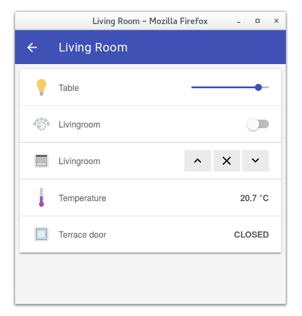



## Basic UI

The Basic UI is a web interface based on Material Design Lite from Google.

Features:

* Responsive layout suitable for various screen sizes
* AJAX navigation
* Live update<sup>1</sup>

<sup>1</sup>: as for now, only control states and icons are updated. Visibility changes require a page reload.

Configuration:

```
org.eclipse.smarthome.basicui:defaultSitemap=demo
# Icons can be disabled
org.eclipse.smarthome.basicui:enableIcons=true
# Icons can be shown as PNG or SVG images
# Default: PNG
org.eclipse.smarthome.basicui:iconType=svg
```

Screenshots:

[](doc/screenshot-1-full.png)
[](doc/screenshot-2-full.png)

