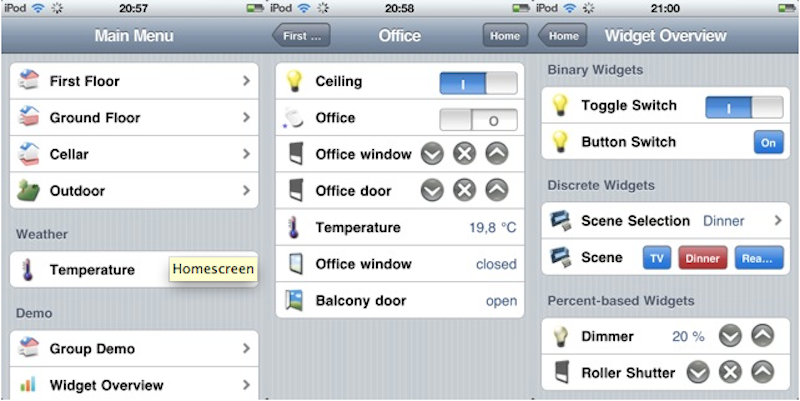



## Classic UI

The Classic UI is the original web user interface of openHAB 1 and thus is the most stable and widely used UI as of today.
Nonetheless, the look and feel does not match modern standards anymore, the [Basic UI](../basic/readme.html) is meant to be its successor.

The Classic UI is based on the [WebApp.Net](http://webapp-net.com/) framework and can be used by any (webkit-based) web browser. 

WebApp.Net consists mainly of Javascript and CSS files and thus has low expectations about the hardware capabilities of the client. In fact, it even works rather smoothly on an iPod 1st gen from 2008.

### Configuration

The Classic UI has a few configuration options, which can also be set through the [Paper UI](../paper/readme.html):

```
# Defining the default sitemap to use
org.eclipse.smarthome.classicui:defaultSitemap=demo

# The icon type to use, either png or svg
org.eclipse.smarthome.classicui:iconType=png

# Disable in-memory caching of html fragments
# If this is true, on every request the html files are loaded from disk (default is false)
org.eclipse.smarthome.classicui:disableHtmlCache=false
```



